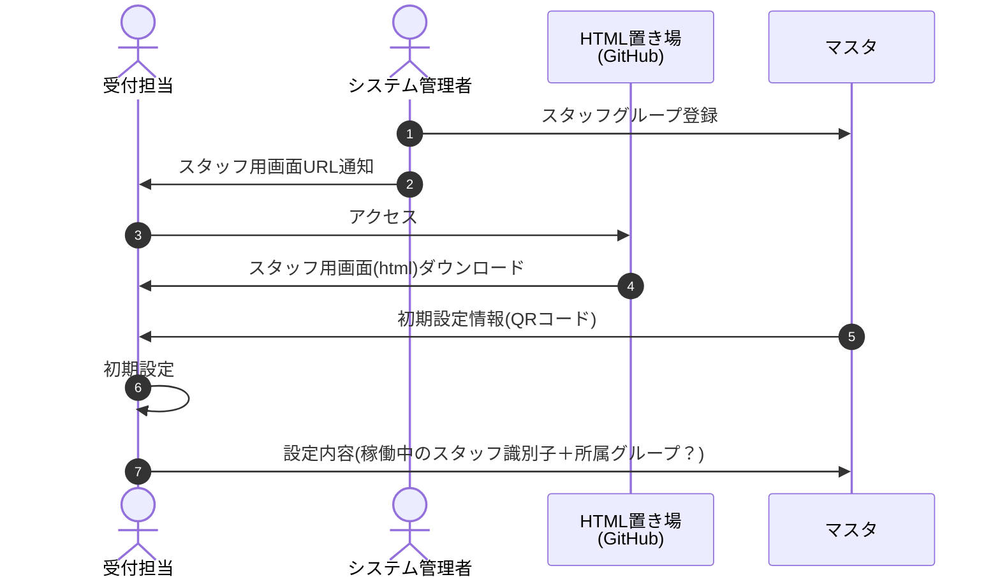
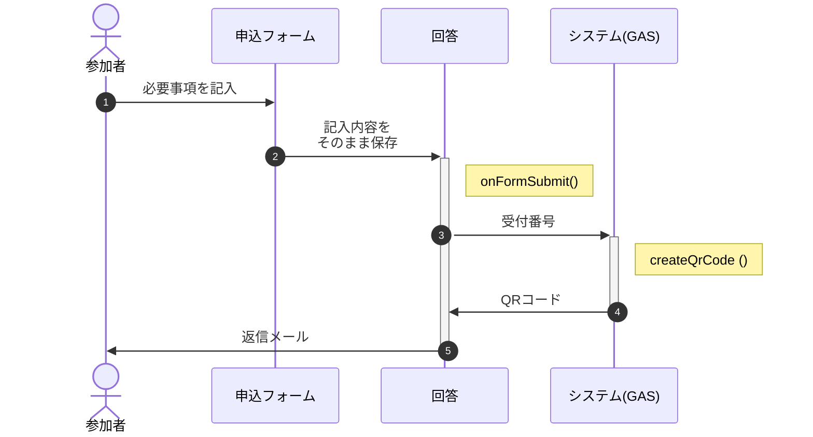
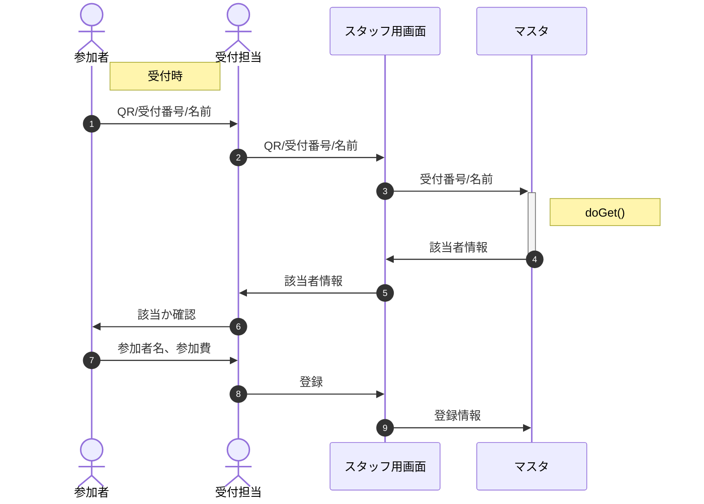

# <a name=""></a>

# <a name="toc"></a>目次

- [Ⅰ.リソース一覧](#1)
- [Ⅱ.処理手順](#2)
  - [Ⅱ.1.初期設定](#21)
  - [Ⅱ.2.フォームでの参加申込](#22)
  - [Ⅱ.3.フォーム登録済参加者の受付](#23)
  - [Ⅱ.4.当日参加票での受付](#24)
  - [Ⅱ.5.一斉配信](#25)
- [Ⅲ.機能別解説](#3)
  - [Ⅲ.1.フォーム](#31)
  - [Ⅲ.2.回答(スプレッドシート)](#32)
    - [(1) doGet: 問合せへの返信](#321)
    - [(2) onFormSubmit: フォーム登録時、参加者にメールを自動返信](#322)
  - [Ⅲ.3.受付担当者画面(html)](#33)
    - [(1) ホーム・QRコードスキャン](#331)
    - [(2) 処理候補選択](#332)
    - [(3) 入力(フォーム登録済分)](#333)
    - [(4) 登録内容詳細](#334)
    - [(5) 入力(当日紙申請分)](#335)
    - [(6) 申込フォームへの誘導(QRコード表示)](#336)
    - [(7) 申込/参加者数集計表](#337)

# <a name="1"></a>Ⅰ.リソース一覧

<table>
  <tr><th>記号</th><th>名称</th><th>格納場所</th><th>種類</th><th>備考</th></tr>
  <tr><td>A</td><td>申込みフォーム</td><td>prototype > 20221006_QR受付 > QR受付テスト</td><td>Google Form</td><td></td></tr>
  <tr><td>B</td><td>回答</td><td>prototype > 20221006_QR受付 > QR受付テスト - 回答</td><td>Google Spread</td><td></td></tr>
  <tr><td>C</td><td>受付画面</td><td>prototype > 20221006_QR受付 > QR受付.html</td><td>html</td><td></td></tr>
  <tr><td>D</td><td>マスタ</td><td>prototype > 20221006_QR受付 > QR受付マスタ - 原本</td><td>Google Spread</td><td></td></tr>
  <tr><td>X</td><td>CDN</td><td colspan="3">※各種ライブラリ</td></tr>
</table>


# <a name="2"></a>Ⅱ.処理手順

## <a name="21"></a>Ⅱ.1.初期設定



「初期設定」では以下の登録を行う。
- GAS WebAPI ID情報の登録
- 識別子(氏名)の登録
- 所属するスタッフのグループ設定


## <a name="22"></a>Ⅱ.2.フォームでの参加申込



「回答」はマスタとなるスプレッドシートを指す。

返信メールには以下の内容を記載する。
- 受付番号
- QRコード(受付番号)
- フォーム修正サイトへの誘導(URL/ボタン)
- 参加者サイトへの誘導(URL/ボタン)

なお一斉配信の配信対象に変動がある可能性があるため、フォームで修正の都度、改めて返信メールを送る。


## <a name="23"></a>Ⅱ.3.フォーム登録済参加者の受付



参加者の変更は極力受付前に終了してもらう。無理なら受付後でも可。


## <a name="24"></a>Ⅱ.4.当日参加票での受付

```mermaid
sequenceDiagram
  autonumber
  actor guest as 参加者
  actor staff as 受付担当
  actor admin as システム管理者
  participant html as C.スタッフ用画面
  participant master as D.マスタ

  admin->>guest    : 記入用紙(用紙番号QR付)
  guest->>staff    : 記入済申込用紙
  staff->>html     : 紙申請処理起動
  html->>+master   : 仮登録申請
  master->>-html   : 受付番号
  html->>staff     : 申込用紙に受付番号を記入
  staff->>+master  : 本登録申請(受付番号記入済用紙の写真＋参加者属性)
  master->>-staff  : 本登録結果
  staff->>guest    : 記入済申込用紙

  guest->>staff    : 記入済申込用紙<br>(帰宅時)


## <a name="25"></a>Ⅱ.5.一斉配信

```mermaid
sequenceDiagram
  autonumber
  actor guest as 参加者
  actor staff as スタッフ
  participant html as C.スタッフ用画面
  participant gHtml as 参加者用画面
  participant json as JSONサーバ

  staff->>html    : 文言、対象、予約時刻
  html->>json     : 登録(CRUD)、予約

  guest->>gHtml   : 参加登録返信メールから誘導、表示
  gHtml->>json     : 参照(10秒毎)
  json->>gHtml     : 対象情報
  gHtml->>guest    : 該当する追加情報があればアラーム
```

フォーム登録の返信メールで参加者用画面へのURLを記載。記載されるURLはクエリ文字列で受付番号＋属性を持たせ、サーバorクライアント側で表示対象の絞り込みを可能にする。

GCPの無料枠に収めるため、送受信の情報量・頻度は極力絞る(Max.1GB/日)

配信対象のグルーピングは以下を想定
- 参加者の属性(ex.未就学児/1〜6年生/卒業生/保護者)
- 受付番号の範囲(ex. No.10以上20以下)
- スタッフの担当(ex. 受付、射的、お化け屋敷、スタッフ全員)

参加者用画面には校内マップ・イベントスケジュール等の「しおり」記載情報も記載する。


## Ⅱ.6.その他

<!-- p>受付担当の業務終了後の秘密保持(アカウント削除)：
  [Android でアカウントを追加または削除する](https://support.google.com/android/answer/7664951?hl=ja)<br>
  ⇒ Web API IDの受け渡しはQRコードで行うため、不要になった
</p -->

綿飴の予約や射的の回数制限、ヨーヨーの販売などを行うなら参加者の個々人の識別が必要になる。
また「綿あめがもうすぐできるよ」等のフィードバックを行う場合、通知先は親のスマホとなるため、受付番号との紐付けが必要になる。

以下は仮に行うとした場合の実現手段の想定。
- 中身は1からの連番であるQRコードを印刷したカードを用意
- 受付時、カードを参加者に配布、受付番号と一括してスキャンして紐付け
- 個別の通知はカード番号→受付番号を特定して一斉配信で

参考：[QR コードを連続で読み取れる Web アプリを作った](https://tech.basicinc.jp/articles/193)

# <a name="3"></a>Ⅲ.機能別解説

## <a name="31"></a>Ⅲ.1.フォーム

### 「質問」タグでの設定

適切な内容が入力されるよう「回答の検証」に以下の正規表現を設定

- 氏名：".+　.+" / ".+"
- 氏名読み："[ァ-ヾ]+　+[ァ-ヾ　]+" / "[ァ-ヾ　]+"

「ヷ」「ヸ」「ヹ」「ヺ」等、ひらがなでは対応する文字がないものがあるので、カタカナで入力
(参考：Unicode
[片仮名](https://ja.wikipedia.org/wiki/%E7%89%87%E4%BB%AE%E5%90%8D_(Unicode%E3%81%AE%E3%83%96%E3%83%AD%E3%83%83%E3%82%AF)),
[平仮名](https://ja.wikipedia.org/wiki/%E5%B9%B3%E4%BB%AE%E5%90%8D_(Unicode%E3%81%AE%E3%83%96%E3%83%AD%E3%83%83%E3%82%AF)))

### 「設定」タグでの設定

- メールアドレスを収集する：ON
- 回答のコピーを回答者に送信：リクエストされた場合
- 回答の編集を許可する：ON


## <a name="#32"></a>Ⅲ.2.回答(スプレッドシート)

QRコード作成時の注意： MDN「[JSON.parse() は末尾のカンマを許容しない](https://developer.mozilla.org/ja/docs/Web/JavaScript/Reference/Global_Objects/JSON/parse#json.parse_%E3%81%AF%E6%9C%AB%E5%B0%BE%E3%81%AE%E3%82%AB%E3%83%B3%E3%83%9E%E3%82%92%E8%A8%B1%E5%AE%B9%E3%81%97%E3%81%AA%E3%81%84)」

⇒ d列に"label:'value',"の文字列を作成し、arrayformula(concatenate(d:d))とすると末尾にカンマが入る。
ついでに単一引用符も許されないので、要注意。

### <a name="321"></a>(1) doGet: 受付画面からの問合せに該当者情報を提供

<details><summary>source</summary>

```javascript
function doGet(e) { // 受付画面からの問合せに該当者情報を提供
  // GASでSpreadSheetにあっさりアクセス
  // https://zenn.dev/sdkfz181tiger/articles/82a91f8bbcc734

  // スプレッドシートにアクセス、「マスタ」からデータ取得
  const sheet = SpreadsheetApp.getActive().getSheetByName(&quot;マスタ&quot;);
  // JSONオブジェクトに変換する
  const rows = sheet.getDataRange().getValues();
  const keys = rows.splice(0, 1)[0];
  const data = rows.map(row =&gt; {
    const obj = {};
    row.map((item, index) =&gt; {
      obj[String(keys[index])] = String(item);
    });
    return obj;
  });

  // 条件に合うレコードを抽出
  const dObj = [];
  if( e.parameter.key ){
    const matchKana = e.parameter.key.match(/^[ァ-ヾ　]+$/);
    const matchNum  = e.parameter.key.match(/^[0-9]+$/);
    if( matchKana || matchNum ){
      console.log(&#039;key = &#039;+e.parameter.key);
      for( let i=0 ; i&lt;data.length ; i++ ){
        console.log(i,
          Number(data[i][&#039;受付番号&#039;]),
          Number(e.parameter.key),
          data[i][&#039;読み&#039;].indexOf(e.parameter.key)
        );
        if( Number(data[i][&#039;受付番号&#039;]) === Number(e.parameter.key)
          || data[i][&#039;読み&#039;].indexOf(e.parameter.key) === 0 ){
          dObj.push(data[i]);
          console.log(&#039;pushed!&#039;,data[i]);
        }
      }
      console.log(&#039;dObj&#039;,dObj);
    }
  }

  // JSON文字列に変換して出力する
  const json = JSON.stringify(dObj, null, 2);
  const type = ContentService.MimeType.JSON;
  return ContentService.createTextOutput(json).setMimeType(type);
}
```

</details>

参考：[GASでSpreadSheetにあっさりアクセス](https://zenn.dev/sdkfz181tiger/articles/82a91f8bbcc734)

以下のウェブアプリURLの末尾に"?key=xxxx"を付加。xxxxは受付番号または氏名読み(前方一致)。
[例] ウェブアプリ : https://script.google.com/macros/s/〜/exec?key=わたなべ</p>

<details><summary>結果として渡されるJSONサンプル</summary>

```
[
  {
    '登録日時': 'Sun Oct 09 2022 14:09:19 GMT+0900 (日本標準時)',
    'メール': 'nakaone.kunihiro@gmail.com',
    '氏名': '国生　さゆり','読み': 'コクショウ　サユリ','参加': '参加する',
    '①氏名': '','①読み': '','①所属': '',
    '②氏名': '','②読み': '','②所属': '',
    '③氏名': '','③読み': '','③所属': '',
    '連絡先': '','引取者': '','備考': '','取消': '',
    '受付番号': '10','編集用URL': 'https://〜',
    '担当': '','課金': '','非課金': '','免除': '','用紙番号': '',
    '申請数(小学生以上)': '1','申請数(未就学児)': '0',
    '参加費': '','状態': '','①参加費': '','①状態': '','②参加費': '','②状態': '','③参加費': '','③状態': '',
    '参加数(小学生以上)': '','参加数(未就学児)': ''
  }
]
```

</details>


### <a name="322"></a>(2) onFormSubmit: フォーム登録時、参加者にメールを自動返信

<details><summary>source</summary>

```
// テストデータ出典
// https://e.usen.com/onyankomember/

const bodyPattern = `
::firstName:: 様

下北沢小学校おやじの会です。この度は参加登録、ありがとうございました。

当日は検温後に受付に行き、添付QRコードまたは受付番号を担当者にお示しください。
=============================
受付番号： ::entryNo::
=============================

なお登録いただいた参加メンバの追加・欠席、または申込みのキャンセルがあった場合、以下のフォームを修正してお知らせください。
::editURL::

当日のお越しをお待ちしております。
`;

const htmlPattern = `
&lt;p&gt;::firstName:: 様&lt;/p&gt;

&lt;p&gt;下北沢小学校おやじの会です。この度は参加登録、ありがとうございました。&lt;/p&gt;

&lt;p&gt;当日は検温後に受付に行き、以下を受付担当者にお示しください。&lt;/p&gt;
&lt;div style=&quot;
  border: solid 2px #f00;
  padding:5px;&quot;&gt;受付番号：
  &lt;p style=&quot;text-align:center;&quot;&gt;
    &lt;span style=&quot;font-size: 3rem;&quot;&gt;::entryNo::&lt;/span&gt;
  &lt;/p&gt;
  &lt;p style=&quot;text-align:center;&quot;&gt;
    &lt;img src=&#039;cid:qr_code&#039; /&gt;
  &lt;/p&gt;
&lt;/div&gt;

&lt;p&gt;もし登録いただいた参加メンバの追加・欠席、または申込みのキャンセルがあった場合、以下から修正してください。&lt;/p&gt;

&lt;p&gt;&lt;a href=&quot;::editURL::&quot; style=&quot;
  display: inline-block;
  padding: 20px 50px 20px 50px;
  text-decoration: none;
  color: white;
  background: blue;
  font-weight: bold;
  border: solid 4px blue;
  border-radius: 8px;&quot;&gt;参加申込の修正&lt;/a&gt;&lt;/p&gt;

&lt;p&gt;なお当日の注意事項・持ち物リストは適宜追加されることがありますので、イベント前日に「&lt;a href=&quot;https://sites.google.com/view/shimokita-oyaji/home/archives/20221001-%E6%A0%A1%E5%BA%AD%E3%83%87%E3%82%A4%E3%82%AD%E3%83%A3%E3%83%B3%E3%83%97&quot;&gt;開催案内&lt;/a&gt;」のページで再度ご確認いただけますようお願い申し上げます。&lt;/p&gt;

&lt;p&gt;当日のお越しをお待ちしております。&lt;/p&gt;
`;

function onFormSubmit(  // メールの自動返信
  e={namedValues:{&#039;メールアドレス&#039;:[&#039;nakaone.kunihiro@gmail.com&#039;]}} // テスト用既定値
) {
  console.log(e.namedValues);

  // 1.受付番号の採番
  // 「回答」シート上で書き込まれた行番号＋「当日」上のデータ件数−ヘッダ1行×2シート
  let entryNo = e.range.rowStart - 2
    + SpreadsheetApp.getActiveSpreadsheet().getSheetByName(&#039;当日&#039;).getLastRow();
  // シートに受付番号を記入
  const sheet = SpreadsheetApp.getActiveSpreadsheet().getSheetByName(&#039;回答&#039;);
  sheet.getRange(&quot;S&quot;+e.range.rowStart).setValue(entryNo); // 受付番号はS列
  entryNo = (&#039;0000&#039;+entryNo).slice(-4);

  // 2.編集用URLの取得
  // 2.1.シート側のキーを生成
  const sKey = sheet.getRange(&quot;A&quot;+e.range.rowStart).getValue().getTime()
    + e.namedValues[&#039;メールアドレス&#039;][0];
  /* 以下だと秒単位でミリ秒が無いためフォームと一致しない
  const sKey = new Date(e.namedValues[&#039;タイムスタンプ&#039;][0]).getTime()
    + e.namedValues[&#039;メールアドレス&#039;][0]; */
  console.log(&#039;sKey = &#039;+sKey);

  // 2.2.フォームデータを全件読み込み
  // FormIdはフォームの編集画面。入力画面、回答後の「回答を記録しました」画面とは異なる。
  const FormId = &quot;1hnQLsY3lRh0gQMGfXoJJqAL_yBpKR6T0h2RFRc8tUEA&quot;;
  const formData = FormApp.openById(FormId).getResponses();

  // 2.3.フォームデータを順次検索
  let editURL = &#039;&#039;;
  for( let i=formData.length-1 ; i&gt;=0 ; i++ ){
    const fKey = formData[i].getTimestamp().getTime()
      + formData[i].getRespondentEmail();
    console.log(i,fKey);
    if( sKey === fKey ){
      console.log(&#039;formData&#039;,formData[i]);
      editURL = formData[i].getEditResponseUrl();
      break;
    }
  }
  console.log(&#039;editURL = &#039;+editURL);

  // 2.4.シートに編集用URLを保存
  sheet.getRange(&quot;T&quot;+e.range.rowStart).setValue(editURL); // 編集用URLはT列

  // 3.本文の編集
  const firstName = e.namedValues[&#039;申請者氏名&#039;][0].match(/^([^　]+)/)[1];
  const body = bodyPattern
    .replace(&quot;::firstName::&quot;,firstName)
    .replace(&quot;::entryNo::&quot;,entryNo)
    .replace(&quot;::editURL::&quot;,editURL);
  /*let body = JSON.stringify(e) + &#039;\n\n&#039;
    + &#039;entryNo = &#039; + entryNo + &#039;\n\n&#039;
    + &#039;editURL = &#039; + editURL + &#039;\n&#039;
  ;*/

  // 3.2.htmlメールの編集
  const options = {
    name: &#039;下北沢小学校おやじの会&#039;,
    replyTo: &#039;shimokitasho.oyaji@gmail.com&#039;,
    //attachments: createQrCode(entryNo),
    htmlBody: htmlPattern
      .replace(&quot;::firstName::&quot;,firstName)
      .replace(&quot;::entryNo::&quot;,entryNo)
      .replace(&quot;::editURL::&quot;,editURL),
    inlineImages: {
      qr_code: createQrCode(entryNo),
    }
  }

  GmailApp.sendEmail(
    e.namedValues[&#039;メールアドレス&#039;][0],  // to
    &#039;【完了】QR受付テストへの登録&#039;,     // subject
    body,
    options
  );
}

const createQrCode = (code_data) =&gt; { // QRコード生成
  let url = &#039;https://chart.googleapis.com/chart?chs=200x200&amp;cht=qr&amp;chl=&#039; + code_data;
  let option = {
      method: &quot;get&quot;,
      muteHttpExceptions: true
    };
  let ajax = UrlFetchApp.fetch(url, option);
  console.log(ajax.getBlob())
  return ajax.getBlob();
}</pre>
      </details>

      AppScript > トリガー > トリガーを追加 > onFormSubmit/フォーム送信時

      <div><h3>1.引数・戻り値</h3>
        引数はフォームから登録された内容の情報。
        <details><summary>サンプル</summary>
          <pre class="hljs" style="display: block; overflow-x: auto; padding: 0.5em; color: rgb(51, 51, 51); background: rgb(248, 248, 248);">{
            <span class="hljs-string" style="color: rgb(221, 17, 68);">"authMode"</span>:<span class="hljs-string" style="color: rgb(221, 17, 68);">"FULL"</span>,
            <span class="hljs-string" style="color: rgb(221, 17, 68);">"namedValues"</span>:{
              <span class="hljs-string" style="color: rgb(221, 17, 68);">"参加者③所属"</span>:[<span class="hljs-string" style="color: rgb(221, 17, 68);">""</span>],
              <span class="hljs-string" style="color: rgb(221, 17, 68);">"参加者③氏名"</span>:[<span class="hljs-string" style="color: rgb(221, 17, 68);">""</span>],
              <span class="hljs-string" style="color: rgb(221, 17, 68);">"タイムスタンプ"</span>:[<span class="hljs-string" style="color: rgb(221, 17, 68);">"2022/10/06 13:08:50"</span>],
              <span class="hljs-string" style="color: rgb(221, 17, 68);">"メールアドレス"</span>:[<span class="hljs-string" style="color: rgb(221, 17, 68);">"nakaone.kunihiro@gmail.com"</span>],
              <span class="hljs-string" style="color: rgb(221, 17, 68);">"参加者②氏名"</span>:[<span class="hljs-string" style="color: rgb(221, 17, 68);">""</span>],
              <span class="hljs-string" style="color: rgb(221, 17, 68);">"参加者②氏名読み"</span>:[<span class="hljs-string" style="color: rgb(221, 17, 68);">""</span>],
              <span class="hljs-string" style="color: rgb(221, 17, 68);">"引取者氏名"</span>:[<span class="hljs-string" style="color: rgb(221, 17, 68);">""</span>],
              <span class="hljs-string" style="color: rgb(221, 17, 68);">"参加者①氏名"</span>:[<span class="hljs-string" style="color: rgb(221, 17, 68);">"内海　和子"</span>],
              <span class="hljs-string" style="color: rgb(221, 17, 68);">"参加者③氏名読み"</span>:[<span class="hljs-string" style="color: rgb(221, 17, 68);">""</span>],
              <span class="hljs-string" style="color: rgb(221, 17, 68);">"緊急連絡先"</span>:[<span class="hljs-string" style="color: rgb(221, 17, 68);">""</span>],
              <span class="hljs-string" style="color: rgb(221, 17, 68);">"備考"</span>:[<span class="hljs-string" style="color: rgb(221, 17, 68);">""</span>],
              <span class="hljs-string" style="color: rgb(221, 17, 68);">"参加者①氏名読み"</span>:[<span class="hljs-string" style="color: rgb(221, 17, 68);">"うつみ
              かずこ"</span>],
              <span class="hljs-string" style="color: rgb(221, 17, 68);">"参加者①所属"</span>:[<span class="hljs-string" style="color: rgb(221, 17, 68);">"4年"</span>],
              <span class="hljs-string" style="color: rgb(221, 17, 68);">"参加者②所属"</span>:[<span class="hljs-string" style="color: rgb(221, 17, 68);">""</span>]
            },
            <span class="hljs-string" style="color: rgb(221, 17, 68);">"range"</span>:{<span class="hljs-string" style="color: rgb(221, 17, 68);">"columnEnd"</span>:<span class="hljs-number" style="color: teal;">14</span>,<span class="hljs-string" style="color: rgb(221, 17, 68);">"columnStart"</span>:<span class="hljs-number" style="color: teal;">1</span>,<span class="hljs-string" style="color: rgb(221, 17, 68);">"rowEnd"</span>:<span class="hljs-number" style="color: teal;">14</span>,<span class="hljs-string" style="color: rgb(221, 17, 68);">"rowStart"</span>:<span class="hljs-number" style="color: teal;">14</span>},
            <span class="hljs-string" style="color: rgb(221, 17, 68);">"source"</span>:{},
            <span class="hljs-string" style="color: rgb(221, 17, 68);">"triggerUid"</span>:<span class="hljs-string" style="color: rgb(221, 17, 68);">"12944381"</span>,
            <span class="hljs-string" style="color: rgb(221, 17, 68);">"values"</span>:[<span class="hljs-string" style="color: rgb(221, 17, 68);">"2022/10/06 13:08:50"</span>,<span class="hljs-string" style="color: rgb(221, 17, 68);">"nakaone.kunihiro@gmail.com"</span>,<span class="hljs-string" style="color: rgb(221, 17, 68);">"内海　和子"</span>,<span class="hljs-string" style="color: rgb(221, 17, 68);">"うつみ　かずこ"</span>,<span class="hljs-string" style="color: rgb(221, 17, 68);">"4年"</span>,<span class="hljs-string" style="color: rgb(221, 17, 68);">""</span>,<span class="hljs-string" style="color: rgb(221, 17, 68);">""</span>,<span class="hljs-string" style="color: rgb(221, 17, 68);">""</span>,<span class="hljs-string" style="color: rgb(221, 17, 68);">""</span>,<span class="hljs-string" style="color: rgb(221, 17, 68);">""</span>,<span class="hljs-string" style="color: rgb(221, 17, 68);">""</span>,<span class="hljs-string" style="color: rgb(221, 17, 68);">""</span>,<span class="hljs-string" style="color: rgb(221, 17, 68);">""</span>,<span class="hljs-string" style="color: rgb(221, 17, 68);">""</span>]
          }
```

</details>

受付番号として`range.rowStart`、一意キーとしてタイムスタンプ＋e-mail`values[0]+values[1]`を使用する。
※ namedValuesでも取得できるが、valuesがFormApp.getResponses()と同じ一次元配列なのでベターと判断。


#### 2.フォーム編集用URLの取得

参加者の追加・削除やキャンセル登録のため、登録者(参加者)がフォームを編集する必要があるが、編集用URLはGoogle Spreadには記録されず、フォームの登録情報にしか存在しない。
そこで①フォームの登録情報を全件取得し、②Google Spreadの登録日時＋e-mailから特定し、③特定された登録情報から編集用URLを取得、という手順を踏む。</p>

※回答シートとフォームで添字が一致しないかと考えたが、結果的には一致していない。よって「タイムスタンプのgetTime()＋e-mail」を検索キーとする。

フォームの全件取得

```
// OK:フォームの編集画面
const FormId = "1vlVbz6DM7hSFsijDPv63GUaz9cozSOxO5_O--SBR9cg";
// NG:フォームの入力画面、回答後の「回答を記録しました」画面, 「回答を編集」のリンク先
//const FormId = "1FAIpQLSewOvfxT2b_jomhMOTG6rw7qX6a_KtFYAz3gkyWPgc9lx7jfA";
const formData = FormApp.openById(FormId).getResponses();
```


編集用URL・登録日時・e-mailの取得

```
for( let i=0 ; i<formData.length ; i++ ){
  console.log("formData["+i+"] : "
    + "getEditResponseUrl=" + formData[i].getEditResponseUrl() + "\n"
    + "key = " + String(new Date(formData[i].getTimestamp()).getTime())
    + formData[i].getRespondentEmail()
  );
}
```

getEditResponseUrl()他のメソッドの詳細については、Google公式 [Class FormResponse](https://developers.google.com/apps-script/reference/forms/form-response)参照。

#### 3.注意事項

1. 運用前、GASコンソールで「実行」し、権限を付与しておく

   でないと"Exception: The script does not have permission"が発生する(参考[StackOverflow](https://stackoverflow.com/questions/28200857/you-do-not-have-permission-to-perform-that-action))

   これは以下のそれぞれについて必要
   - メールの送信(GmailApp.sendEmail)
   - Google Spreadへのアクセス(getLastRow)
   - createQrCode

   参考：上記以前に実行した対処(これだけではNG)
   - [appsscript.jsonの修正](https://qiita.com/kajirikajiri/items/84b9a9fee61cbc3bf124)
   - [appsscript.jsonの表示](https://blog-and-destroy.com/42443)

2. 管理者への回答通知を回避する設定

フォーム > 回答タグ > スプレッドシートアイコン右のメニュー >
「新しい回答についてのメール通知を受け取る」のチェックを外す

#### 4.参考

- [メールの自動返信](https://blog.hubspot.jp/google-forms-automatic-reply#f)
- [メールへのファイル添付](https://my-funs.com/gas-mailapp/)
- [GASでHTMLメールを送る方法とインライン画像を埋め込む(画像挿入)方法](https://auto-worker.com/blog/?p=2827)


### (3) createQrCode: 渡された文字列からQRコード(Blob)を生成

#### 引数・戻り値

参考：[Google Apps ScriptでQRコードを生成してみる](https://note.com/himajin_no_asobi/n/n51de21bf73e5)

#### <details><summary>デプロイ履歴</summary>

  ※タイトルは「スマホ受付 rev.x」とする。
  <pre>
    バージョン 3（10月9日 18:00）
    デプロイ ID
    AKfycbwLUU_XxDtn9sDjTZccuIfM9Od6DdjYEX7m2QkgWi73d7fjNEcCVGIjD7OmDkBDv4ihog
    ウェブアプリ
    URL
    https://script.google.com/macros/s/AKfycbwLUU_XxDtn9sDjTZccuIfM9Od6DdjYEX7m2QkgWi73d7fjNEcCVGIjD7OmDkBDv4ihog/exec
  </pre>
  <pre>
    バージョン 2（10月9日 13:44）
    デプロイ ID
    AKfycbzvJ76fOmgoB70kpkm4-TXUCJNfS7G1j_JTev-inCLe4kxEYzQ33sHhQvBZLmzOYpFT
    ウェブアプリ
    URL
    https://script.google.com/macros/s/AKfycbzvJ76fOmgoB70kpkm4-TXUCJNfS7G1j_JTev-inCLe4kxEYzQ33sHhQvBZLmzOYpFT/exec
  </pre>
  <pre>
    バージョン 1（10月9日 13:37）
    デプロイ ID
    AKfycbx_lxQmFxZ20dfK7TqdbE0WSnIfBcNRgVEM9l_V9-8r-nb3mzlmLS6HS4-1EJxUVHS1jA
    ウェブアプリ
    URL
    https://script.google.com/macros/s/AKfycbx_lxQmFxZ20dfK7TqdbE0WSnIfBcNRgVEM9l_V9-8r-nb3mzlmLS6HS4-1EJxUVHS1jA/exec
    </pre>
</details>


## <a name="33"></a>Ⅲ.3.受付担当者画面(html)

### temp

[WordPressに静的サイトを共存させてみる]("https://shu-sait.com/wordpres-html-kyouzon/#:~:text=%E9%9D%99%E7%9A%84%E3%82%B5%E3%82%A4%E3%83%88%E3%81%AE%E3%83%95%E3%82%A9%E3%83%AB%E3%83%80%E3%81%ABhtml%E3%83%95%E3%82%A1%E3%82%A4%E3%83%AB%E3%82%92%E3%82%A2%E3%83%83%E3%83%97,-%E4%BD%9C%E6%88%90%E3%81%97%E3%81%9F%E3%83%95%E3%82%A9%E3%83%AB%E3%83%80&text=%E3%81%9D%E3%81%97%E3%81%A6URL%E3%81%ABhtml%E3%83%95%E3%82%A1%E3%82%A4%E3%83%AB,%E3%81%A6%E3%81%84%E3%82%8B%E3%81%8B%E3%81%A8%E6%80%9D%E3%81%84%E3%81%BE%E3%81%99%E3%80%82)

- Google CloudでSSHコンソールを開く
- "/var/www/html/static/"に移動
- コンソールからzipファイルをアップロード
- ユーザルートにアップロードされたファイルを格納場所に移動
- unzip

ファイルのGCPへのアップロード：Google Cloud [ブラウザの SSH を使用したファイルの転送](https://cloud.google.com/compute/docs/instances/transfer-files?hl=ja#transferbrowser)

### (1) ホーム・QRコードスキャン

#### 参考

[HTML と JavaScript だけで QR コード読み取り](http://dotnsf.blog.jp/archives/1078584611.html)
以下はボタン操作が不要になるが、https通信が必要になるので、次期開発で対応
[Webの技術だけで作るQRコードリーダー](https://qiita.com/kan_dai/items/4331aae12f5f2d3ad18d)
[続・Webの技術だけで作るQRコードリーダ](https://qiita.com/kan_dai/items/3486880236a2fcd9b527)
Zenn [jsQRであっさりQRコードリーダ/メーカ](https://zenn.dev/sdkfz181tiger/articles/096dfb74d485db)


### <a name="332"></a>(2) 処理候補選択


### <a name="333"></a>(3) 入力(フォーム登録済分)


### <a name="334"></a>(4) 登録内容詳細


### <a name="335"></a>(5) 入力(当日紙申請分)


### <a name="336"></a>(6) 申込フォームへの誘導(QRコード表示)


### <a name="337"></a>(7) 申込/参加者数集計表

# <a name="4"></a>Ⅳ.開発履歴

<details><summary>2022/10/06 : 改善しようとして動作不良</summary>

```
// テストデータ出典
// https://e.usen.com/onyankomember/

const adminMail = 'shimokitasho.oyaji@gmail.com';
// フォームの編集画面のID
const formId = "1vlVbz6DM7hSFsijDPv63GUaz9cozSOxO5_O--SBR9cg";
// NG : フォームの入力画面、回答後の「回答を記録しました」画面, 「回答を編集」のリンク先
//const formId = "1FAIpQLSewOvfxT2b_jomhMOTG6rw7qX6a_KtFYAz3gkyWPgc9lx7jfA";

const onFormSubmit = (  // メールの自動返信
  arg={namedValues:{'メールアドレス':['nakaone.kunihiro@gmail.com']}} // テスト用既定値
) => {
  console.log('onFormSubmit start.');
  try {
    // 1. エラーまたはテストなら管理者にメールを出して終了
    if( !arg.authMode )
      throw new Error('引数のメンバにauthModeがありません');

    // 2. 受付番号の採番
    const receptNum = arg.range.rowStart;
    console.log('receptNum = '+receptNum);

    // 3. 修正用URLの取得
    const editURL = getEditURL(
      String(new Date(arg.values[0]).getTime()) + arg.values[1]
    );
    console.log('editURL = '+editURL);

    // 4. QRコードの生成
    const QRobj = createQrCode(receptNum);

    // 5.本文の作成
    let body =
      arg.namedValues['参加者①氏名'][0].match(/^(.+)[ |　]*/)[1] + '様\n\n'
      + 'この度はホニャララ\n\n'
      + 'あなたの受付番号は以下になります。\n'
      + '==============================\n'
      + '受付番号：' + receptNum + '\n'
      + '==============================\n'
      + '当日、受付で添付QRコードまたは受付番号を係員にお示しください。\n\n'
      + '参加者の追加・削除等の修正、またはキャンセルの場合、以下から登録内容を修正願います。\n'
      + '※キャンセルの場合、一番下の「キャンセル」にチェックしてください\n'
      + editURL + '\n\n'
      + '参加登録、ありがとうございました。\n'
      ;
    console.log('body = '+body);

    // 6.メールの送信
    GmailApp.sendEmail(
      arg.namedValues['メールアドレス'][0],  // to
      '【完了】QR受付テストへの登録',     // subject
      body,
      {
        name: '下北沢小学校おやじの会',
        replyTo: 'shimokitasho.oyaji@gmail.com',
        attachments: createQrCode(receptNum),
      }
    );

  } catch(e) {

    let body = e.message + '\n\n'
      + 'arg = ' + JSON.stringify(arg);

    // 管理者にエラーメールを送る
    GmailApp.sendEmail(
      adminMail,  // to
      '[Error] QR受付テストへの登録',     // subject
      body
    );
  }
}

const createQrCode = (code_data) => { // QRコード生成
  let url = 'https://chart.googleapis.com/chart?chs=300x300&cht=qr&chl=' + code_data;
  let option = {
    method: "get",
    muteHttpExceptions: true
  };
  let ajax = UrlFetchApp.fetch(url, option);
  return ajax.getBlob();
}

const getEditURL = (key) => {
  console.log('getEditURL start. key='+key);

  // フォームの全データを取得
  const formData = FormApp.openById(formId).getResponses();
  console.log('formData = '+JSON.stringify(formData));

  // 順次検索、当たったらリンク先を返して終了
  for( let i=formData.length ; i>=0 ; i-- ){
    console.log('formData['+i+']='+JSON.stringify(formData[i]));
    const val = String(new Date(formData[i].getTimestamp()).getTime())
    + formData[i].getRespondentEmail();
    console.log('val = '+val+', =key?:'+(val===key));
    if( val === key ){
      console.log('getEditURL successed');
      return (formData[i].getEditResponseUrl());
    }
  }
  // マッチするものが無かった場合
  console.log('getEditURL failed.');
  return new Error('マッチするものがありません\n'
    + 'getEditURL.formData = ' + JSON.stringify(formData) + '\n'
    + 'getEditURL.key = "' + key + '"\n'
    + 'getEditURL.val = "' + val + '"\n'
  );
}
```

</details>

<details><summary>2022/10/06 : onFormSubmit, createQrCode 作成</summary>

```
function onFormSubmit(  // メールの自動返信
    /*
    ■参考
      メールの自動返信
      https://blog.hubspot.jp/google-forms-automatic-reply#f
      添付メールを含むGmailApp
      https://my-funs.com/gas-mailapp/

    ■引数
      namedValues:
      { '引取者氏名': [ '' ],
        '参加者③氏名読み': [ '' ],
        'タイムスタンプ': [ '2022/10/06 10:03:37' ],
        '参加者②氏名読み': [ '' ],
        '備考': [ '' ],
        'メールアドレス': [ 'nakaone.kunihiro@gmail.com' ],
        '参加者③所属': [ '' ],
        '参加者③氏名': [ '' ],
        '参加者②氏名': [ '' ],
        '参加者①所属': [ '5年' ],
        '緊急連絡先': [ '' ],
        '参加者②所属': [ '' ],
        '参加者①氏名読み': [ 'なかじま　みはる' ],
        '参加者①氏名': [ '中島　美春' ] },

  {"authMode":"FULL","namedValues":{"参加者③所属":[""],"参加者③氏名":[""],"タイムスタンプ":["2022/10/06
  13:08:50"],"メールアドレス":["nakaone.kunihiro@gmail.com"],"参加者②氏名":[""],"参加者②氏名読み":[""],"引取者氏名":[""],"参加者①氏名":["内海
  和子"],"参加者③氏名読み":[""],"緊急連絡先":[""],"備考":[""],"参加者①氏名読み":["うつみ
  かずこ"],"参加者①所属":["4年"],"参加者②所属":[""]},"range":{"columnEnd":14,"columnStart":1,"rowEnd":14,"rowStart":14},"source":{},"triggerUid":"12944381","values":["2022/10/06
  13:08:50","nakaone.kunihiro@gmail.com","内海　和子","うつみ
  かずこ","4年","","","","","","","","",""]}

    行番号は e.range.rowStart, rowEnd
    タイムスタンプは values[0]
    e-mailは values[1] で取得可。
    namedValuesでも取得できるが、valuesがFormApp.getResponses()と同じ一次元配列なのでベター？


    ■Exception: The script does not have permission
      本コンソールで「実行」し、権限を付与しておく
      https://stackoverflow.com/questions/28200857/you-do-not-have-permission-to-perform-that-action

      これは以下のそれぞれについて必要
      ・メールの送信(GmailApp.sendEmail)
      ・Google Spreadへのアクセス(getLastRow)
      ・createQrCode

      上記以前に実行した対処(これだけではNG)
      appsscript.jsonの修正
      https://qiita.com/kajirikajiri/items/84b9a9fee61cbc3bf124
      appsscript.jsonの表示
      https://blog-and-destroy.com/42443

    ■管理者への回答通知を回避する設定
    　フォーム > 回答タグ > スプレッドシートアイコン右のメニュー >
      「新しい回答についてのメール通知を受け取る」のチェックを外す

    */
    e={namedValues:{'メールアドレス':['nakaone.kunihiro@gmail.com']}} // テスト用既定値
  ) {
    console.log(e.namedValues);

    // 最終行の取得(=受付番号)
    const lastRow = SpreadsheetApp.getActiveSpreadsheet().getSheetByName('回答').getLastRow();

    let body = JSON.stringify(e) + '\n\n'
    //let body = JSON.stringify(e.namedValues) + '\n\n'
      + 'lastRow = ' + lastRow + '\n';


    GmailApp.sendEmail(
      e.namedValues['メールアドレス'][0],  // to
      '【完了】QR受付テストへの登録',     // subject
      body,
      {
        name: '下北沢小学校おやじの会',
        replyTo: 'shimokitasho.oyaji@gmail.com',
        attachments: createQrCode(lastRow),
      }
    );
  }

  const createQrCode = (code_data) => { // QRコード生成
    /*
    ■参考
      Google Apps ScriptでQRコードを生成してみる
      https://note.com/himajin_no_asobi/n/n51de21bf73e5
    */
    let url = 'https://chart.googleapis.com/chart?chs=200x200&cht=qr&chl=' + code_data;
    let option = {
        method: "get",
        muteHttpExceptions: true
      };
    let ajax = UrlFetchApp.fetch(url, option);
    console.log(ajax.getBlob())
    return ajax.getBlob();
  }

  const getEditTest = () => {
    /* 回答シートの全データを取得
      回答シートとフォームで添字が一致しないかと考えたが、結果的には一致していない。
      よって「タイムスタンプのgetTime()＋e-mail」を検索キーとする。
      なおsheetDataのタイムスタンプは"2022-10-06T03:17:22.506Z"形式
    */
    const sheetData = SpreadsheetApp.getActiveSpreadsheet().getSheetByName("回答").getDataRange().getValues();
    const sheetMap = {};
    for( let i=0 ; i<sheetData.length ; i++ ){
      sheetMap[String(new Date(sheetData[i][0]).getTime()) + sheetData[i][1]] = i;
    }
    console.log("sheetMap = "+JSON.stringify(sheetMap));

    // フォームの全データを取得
    // フォームの編集画面
    const FormId = "1vlVbz6DM7hSFsijDPv63GUaz9cozSOxO5_O--SBR9cg";
    // フォームの入力画面、回答後の「回答を記録しました」画面, 「回答を編集」のリンク先
    //const FormId = "1FAIpQLSewOvfxT2b_jomhMOTG6rw7qX6a_KtFYAz3gkyWPgc9lx7jfA";
    const formData = FormApp.openById(FormId).getResponses();

    for( let i=0 ; i<formData.length ; i++ ){
      //console.log("sheetData["+i+"] : " + JSON.stringify(sheetData[i]));
      // メソッドの詳細は以下参照
      // https://developers.google.com/apps-script/reference/forms/form-response
      console.log("formData["+i+"] : "
        //+ "toString = " + formData[i].toString() + "\n"
        //+ "submit = " + formData[i].submit() + "\n"
        //+ "getId = " + formData[i].getId() + "\n"  // getEditResponseForItemの後半部分と一致
        + "getRespondentEmail = " + formData[i].getRespondentEmail() + "\n"
        //+ "getItemResponses = " + formData[i].getItemResponses() + "\n"  // １つ１つの質問項目の回答を管理
        //+ "getGradableItemResponses = " + formData[i].getGradableItemResponses() + "\n"
        //+ "withItemGrade = " + formData[i].withItemGrade() + "\n"
        //+ "withItemResponse = " + formData[i].withItemResponse() + "\n"
        //+ "getGradableResponseForItem = " + formData[i].getGradableResponseForItem() + "\n"
        //+ "getResponseForItem = " + formData[i].getResponseForItem() + "\n"
        //+ "toPrefilledUrl = " + formData[i].toPrefilledUrl() + "\n"
        + "getEditResponseUrl=" + formData[i].getEditResponseUrl() + "\n"
        //+ "getTimestamp = " + formData[i].getTimestamp() + "\n"
        + "toLocaleString = " + formData[i].getTimestamp().toLocaleString('ja-JP')
        + "." + formData[i].getTimestamp().getMilliseconds() + "\n"
        + "sheetData = " + JSON.stringify(sheetData[sheetMap[
          String(new Date(formData[i].getTimestamp()).getTime())
          + formData[i].getRespondentEmail()
        ]])
      );
    };
  }
```
</details>