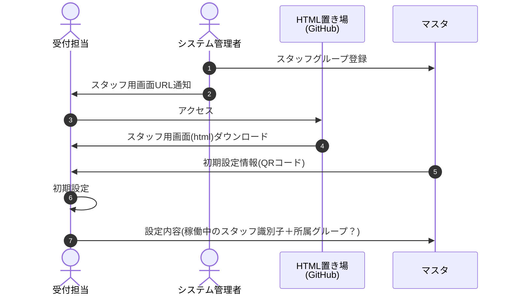
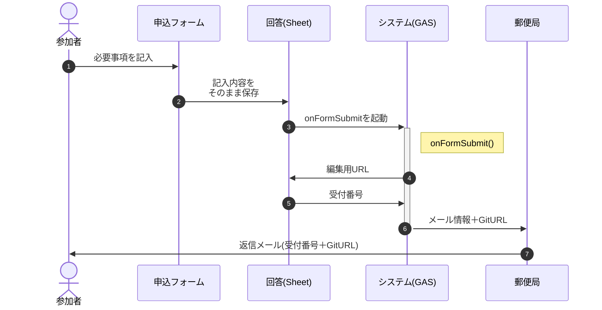
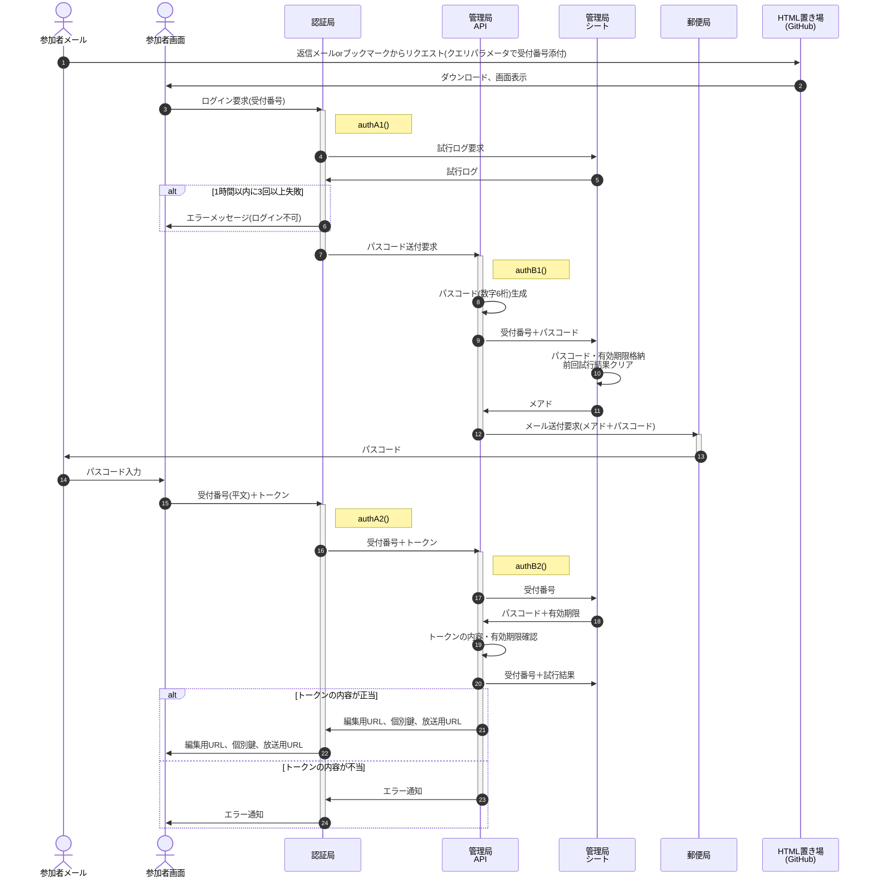
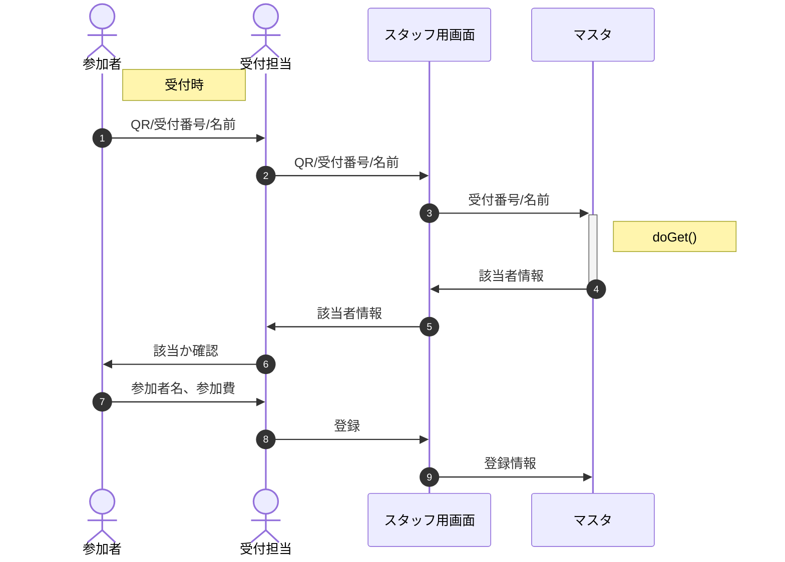
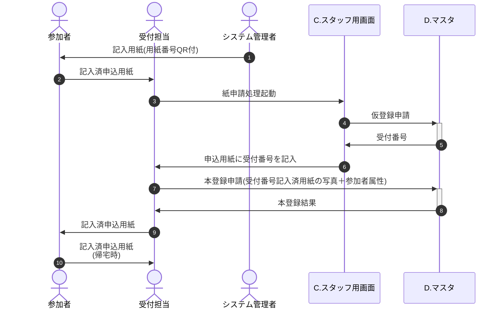
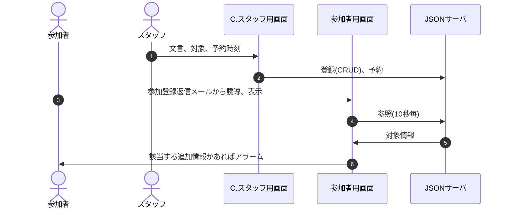

# 開発の目的

## 現状

- 受付の効率化のため、参加申請を紙ベースからGoogle Formに変更
- 参加者へのイベント進行案内は、紙ベースの「予定表」として配布
- スタッフ間の連携は、基本的に対面ベース

## 課題

1. フォームになって申込期限ギリギリの申請が増加、当日参加が爆発的に発生
   - 需要予測が困難(ex.綿あめの担当者は足りる？　カレーは何食分用意する？)<br>※ 紙ベースならリアルタイムに把握できないのだから、そもそも気にしない？
   - 当日参加は受付担当のみ概数を把握(詳細は無理)、スタッフ全員に伝えるのも困難
   - 当日参加用申込用紙が途中でなくなり、フリーフォーマットで対応
     - 書き方の案内が必要、受付が忙しくなるにつれどんどん適当に(必要事項の記載漏れ)

2. 各コーナーの状況がスタッフ・参加者共わからない
   - 「カレーは何時から配膳？(今から参加して食べられる？)」「缶バッチはまだやってる？」「うちの子の肝試しは何時頃終わる？(何時にお迎えに来れば良い？)」
   - 参加者はもちろん、スタッフも担当外のコーナーの状況はわからない

3. 希望の多いコーナーは混雑・混乱、参加者の不満に
   - 長蛇の列に並んでいる時間が長く、他のコーナーを見に行けない
   - 同じ子が何度も参加、横入りされたり小さい子が諦める事例も

## 解決案

1. 当日参加も含め、参加申請はフォームでイベント終了まで受付
   - 受付でのチェックはクラウド上の名簿を参照<br>※万一に備え紙ベースの名簿はバックアップとして用意
   - 紙での申請はスマホが無い当日参加希望者のみ、受付担当は【必要最低限の属性情報のみ】入力

2. スタッフ・参加者は自分のスマホで(ほぼ)リアルタイムに状況を把握可能に
   - スタッフ用に双方向の業務連絡を実現(簡易チャット。ex.「お手隙のスタッフは綿あめ周辺の誘導に来て」)
   - 自担当イベントの進行状況は随時発信。参加者も参照可能に。
   - マスタと連携して参加者をセグメント化、各種お知らせを配信(※スタッフ→参加者の一方向)<br>例：「受付番号100番までの1年生のご家族はカレーをお受け取りください」
   - 配信用端末(スマホ)が無い人のためには、本部前へのディスプレイ設置等で別途対応

3. コーナー毎に順番の予約を可能に
   - 参加者個々人にQRコード(参加者番号)が印刷されたカードを配布
   - コーナーの前に端末を用意、QRコードを読ませて予約(状態：予約中)、順番が来たらもう一度読ませる(状態：参加中)<br>
     ※できれば終了時点でもう一度読ませたい(状態：無予約)が、面倒そう...
   - 端末では「参加した回数」と「予約時刻」をキーに参加者番号を表示、コーナー担当は表示順にその場にいる子を呼ぶ<br>※その場にいない子はスキップするが、順番はトップが維持される

## 解決案を実行した場合に予想される副次的メリット、デメリット

- メリット
  - カレー配膳や肝試し等、セグメント別の誘導が円滑になる
  - 「アンケートのお願い」等、従来メアドがわからなかった当日参加の方にも当日・事後に連絡がつけられるようになる

- デメリット
  - 期限ギリギリの申請・当日参加がより増える
    - 対策案：申請期限の設定は継続、期限前＞期限〜前日＞当日の順に優先(ex.テント設営場所、配膳の順番、ゲームコーナー)
  - 慣れない手順なのでスタッフ側が事前に習熟しておく必要がある(学習コストが発生)
    - 対策案：学習コストは極限まで切り詰め、1時間程度に収める(UIを工夫、「次に何をすれば良いか」を常に表示)
    - 対策案：常連のスタッフは事前に、スポット参加のスタッフは当日朝に時間をとる

## 開発の方針・制約

本来状況把握はプッシュ型で行いたかったが、GASの「トリガーの総実行時間：90分/日」という[制約](https://tetsuooo.net/gas/1101/#)から、プル型とする。

総実行時間90分 = 5,400秒 ＜ 平均滞在時間4時間 × 3600秒 ÷ インターバル20秒/回 × 想定利用者300名 × 実行時間0.3秒/回 = 64,800秒 

具体的には「情報が書き込まれたGoogleスプレッドを見にいく」という形で、htmlに`<iframe src="https://docs.google.com/〜?gid=〜&range=A1:B">〜</iframe>`のように設定する。

予約状況はそれだけで専用のシートを用意。スプレッドシート列毎に参加者専用スペースを確保、htmlから見にいく列を制御する。

掲示板も参加者専用スペースを用意、絞り込みを可能にする。

予約状況は予約が入った時点で更新する(定期的に見にいくと回数が徒に増える。参加者500名×コーナー平均参加回数15回×予約・参加時点の2回×実行時間0.3秒なら実行時間は4,500秒に抑えられる。一定時間経たないと送信しないという運用もありか)。

予約状況は総予約数の他に、利用回数別の予約人数を表示する。


# Ⅰ.リソース一覧

<table>
  <tr><th>記号</th><th>名称</th><th>格納場所</th><th>種類</th><th>備考</th></tr>
  <tr><td>A</td><td>申込みフォーム</td><td>prototype > 20221006_QR受付 > QR受付テスト</td><td>Google Form</td><td></td></tr>
  <tr><td>B</td><td>回答</td><td>prototype > 20221006_QR受付 > QR受付テスト - 回答</td><td>Google Spread</td><td></td></tr>
  <tr><td>C</td><td>受付画面</td><td>prototype > 20221006_QR受付 > QR受付.html</td><td>html</td><td></td></tr>
  <tr><td>D</td><td>マスタ</td><td>prototype > 20221006_QR受付 > QR受付マスタ - 原本</td><td>Google Spread</td><td></td></tr>
  <tr><td>X</td><td>CDN</td><td colspan="3">※各種ライブラリ</td></tr>
</table>


# Ⅱ.処理手順

## Ⅱ.1.初期設定



「初期設定」では以下の登録を行う。
- GAS WebAPI ID情報の登録
- 識別子(氏名)の登録
- 所属するスタッフのグループ設定


## Ⅱ.2.フォームでの参加申込

### 登録



- 「回答」はマスタとなるスプレッドシートを指す。
- メールはGASのメール100通/日の制限を回避するため、複数のアカウントに送信専用APIを用意し、順次使用する。

- 返信メールには以下の内容を記載する。
  - 受付番号
  - GitHub URL

### 認証



- 伝送説明文の末尾の括弧は、暗号化する際の鍵。「受付番号(共通鍵)」は「受付番号を共通鍵で暗号化した文字列」の意味
- トークンは受付番号・パスコードと時刻を基に生成されるワンタイムパスワード(TOTP)
  - パスコードは6桁の数字、時刻は10分単位で採番したものをハッシュ化して復元不能にする。<br>
    受付番号 1234 ＋ パスコード 567890 ＋ 2022/10/30 05:26:02 -> 123456789020221030052
  - 端末・サーバ間の時刻のずれやネットワークの遅延を考慮し、復号時は処理時点と前後1スパンを許容<br>-> 1030052, 1030051 , 1030053
- 認証は参加者画面を開く都度行う(localStorageへの保存は行わない)
- 参加者画面(html)は、クエリパラメータが存在しなければ受付番号入力(＋QRコードスキャン)画面を、存在すればそれを共通鍵で暗号化された受付番号と見做しパスコード入力画面を表示する


## Ⅱ.3.フォーム登録済参加者の受付



参加者の変更は極力受付前に終了してもらう。無理なら受付後でも可。


## Ⅱ.4.当日参加票での受付



## Ⅱ.5.一斉配信



フォーム登録の返信メールで参加者用画面へのURLを記載。記載されるURLはクエリ文字列で受付番号＋属性を持たせ、サーバorクライアント側で表示対象の絞り込みを可能にする。

GCPの無料枠に収めるため、送受信の情報量・頻度は極力絞る(Max.1GB/日)

配信対象のグルーピングは以下を想定
- 参加者の属性(ex.未就学児/1〜6年生/卒業生/保護者)
- 受付番号の範囲(ex. No.10以上20以下)
- スタッフの担当(ex. 受付、射的、お化け屋敷、スタッフ全員)

参加者用画面には校内案内図・イベントスケジュール等の「しおり」記載情報も記載する。


## Ⅱ.6.その他

<!-- p>受付担当の業務終了後の秘密保持(アカウント削除)：
  [Android でアカウントを追加または削除する](https://support.google.com/android/answer/7664951?hl=ja)<br>
  ⇒ Web API IDの受け渡しはQRコードで行うため、不要になった
</p -->

綿飴の予約や射的の回数制限、ヨーヨーの販売などを行うなら参加者の個々人の識別が必要になる。
また「綿あめがもうすぐできるよ」等のフィードバックを行う場合、通知先は親のスマホとなるため、受付番号との紐付けが必要になる。

以下は仮に行うとした場合の実現手段の想定。
- 中身は1からの連番であるQRコードを印刷したカードを用意
- 受付時、カードを参加者に配布、受付番号と一括してスキャンして紐付け
- 個別の通知はカード番号→受付番号を特定して一斉配信で

参考：[QR コードを連続で読み取れる Web アプリを作った](https://tech.basicinc.jp/articles/193)

# Ⅲ.クラウド

## Ⅲ.1.フォーム

### 「質問」タグでの設定

適切な内容が入力されるよう「回答の検証」に以下の正規表現を設定

- 氏名：".+　.+" / ".+"
- 氏名読み："[ァ-ヾ]+　+[ァ-ヾ　]+" / "[ァ-ヾ　]+"

「ヷ」「ヸ」「ヹ」「ヺ」等、ひらがなでは対応する文字がないものがあるので、カタカナで入力
(参考：Unicode
[片仮名](https://ja.wikipedia.org/wiki/%E7%89%87%E4%BB%AE%E5%90%8D_(Unicode%E3%81%AE%E3%83%96%E3%83%AD%E3%83%83%E3%82%AF)),
[平仮名](https://ja.wikipedia.org/wiki/%E5%B9%B3%E4%BB%AE%E5%90%8D_(Unicode%E3%81%AE%E3%83%96%E3%83%AD%E3%83%83%E3%82%AF)))

### 「設定」タグでの設定

- メールアドレスを収集する：ON
- 回答のコピーを回答者に送信：リクエストされた場合
- 回答の編集を許可する：ON


## Ⅲ.2.回答(スプレッドシート)

### 「回答」シート

### 「当日」シート

### 「マスタ」シート

### 「config」シート

QRコード作成時の注意： MDN「[JSON.parse() は末尾のカンマを許容しない](https://developer.mozilla.org/ja/docs/Web/JavaScript/Reference/Global_Objects/JSON/parse#json.parse_%E3%81%AF%E6%9C%AB%E5%B0%BE%E3%81%AE%E3%82%AB%E3%83%B3%E3%83%9E%E3%82%92%E8%A8%B1%E5%AE%B9%E3%81%97%E3%81%AA%E3%81%84)」

⇒ d列に"label:'value',"の文字列を作成し、arrayformula(concatenate(d:d))とすると末尾にカンマが入る。
ついでに単一引用符も許されないので、要注意。

## Ⅲ.3.回答(GAS)

### GASソース(全体)

```
const passPhrase = "Oct.22,2022"; // テスト用共通鍵

// ===========================================================
// トリガー関数
// ===========================================================

const doGetTest = () => {
  const testData = [
    //{func:'test',data:{from:'嶋津',to:'スタッフ',message:'ふがふが'}},
    //{func:'search',data:{key:'ナ'}},
    {func:'update',data:{target:{key:'受付番号',value:12},revice:[
      {key:'状態',value:'参加'},
      {key:'参加費',value:'既収'},
    ]}},
  ];
  for( let i=0 ; i<testData.length ; i++ ){
    doGet({parameter:{v:encrypt(testData[i],passPhrase)}});
  }
};

function doGet(e) {
  console.log('doGet start.',e);

  // 'v'で渡されたクエリを復号
  arg = decrypt(e.parameter.v,passPhrase);
  console.log('arg',whichType(arg),arg);

  let rv = [];
  switch( arg.func ){  // 処理指定により分岐
    case 'search':  // 該当者の検索
      rv = candidates(arg.data);
      break;
    case 'update':  // 参加者情報の更新
      rv = updateParticipant(arg.data);
      break;
    case 'post':  // 掲示板への投稿
      rv = postMessage(arg.data);
      break;
    case 'test':  // テスト用
      rv = arg.data;  // 何もせず、そのまま返す
      break;
  }

  // 結果をJSON化して返す
  rv = JSON.stringify(rv,null,2);
  console.log('doGet end.',rv);
  return ContentService
  .createTextOutput(rv)
  .setMimeType(ContentService.MimeType.JSON);
}

/** メールの自動返信
 * @param {Object} e - 
 */
function onFormSubmit(  // メールの自動返信
  e={namedValues:{'メールアドレス':['nakaone.kunihiro@gmail.com']}} // テスト用既定値
) {
  console.log(e.namedValues);

  // 1.受付番号の採番
  // 「回答」シート上で書き込まれた行番号＋「当日」上のデータ件数−ヘッダ1行×2シート
  let entryNo = e.range.rowStart - 2
    + SpreadsheetApp.getActiveSpreadsheet().getSheetByName('当日').getLastRow();
  // シートに受付番号を記入
  const sheet = SpreadsheetApp.getActiveSpreadsheet().getSheetByName('回答');
  sheet.getRange("S"+e.range.rowStart).setValue(entryNo); // 受付番号はS列
  entryNo = ('0000'+entryNo).slice(-4);

  // 2.編集用URLの取得
  // 2.1.シート側のキーを生成
  const sKey = sheet.getRange("A"+e.range.rowStart).getValue().getTime()
    + e.namedValues['メールアドレス'][0];
  /* 以下だと秒単位でミリ秒が無いためフォームと一致しない
  const sKey = new Date(e.namedValues['タイムスタンプ'][0]).getTime()
    + e.namedValues['メールアドレス'][0]; */
  console.log('sKey = '+sKey);

  // 2.2.フォームデータを全件読み込み
  // FormIdはフォームの編集画面。入力画面、回答後の「回答を記録しました」画面とは異なる。
  const FormId = "1hnQLsY3lRh0gQMGfXoJJqAL_yBpKR6T0h2RFRc8tUEA";
  const formData = FormApp.openById(FormId).getResponses();

  // 2.3.フォームデータを順次検索
  let editURL = '';
  for( let i=formData.length-1 ; i>=0 ; i++ ){
    const fKey = formData[i].getTimestamp().getTime()
      + formData[i].getRespondentEmail();
    console.log(i,fKey);
    if( sKey === fKey ){
      console.log('formData',formData[i]);
      editURL = formData[i].getEditResponseUrl();
      break;
    }
  }
  console.log('editURL = '+editURL);

  // 2.4.シートに編集用URLを保存
  sheet.getRange("T"+e.range.rowStart).setValue(editURL); // 編集用URLはT列

  // 3.本文の編集
  const firstName = e.namedValues['申請者氏名'][0].match(/^([^　]+)/)[1];
  const body = 'dummy';

  // 3.2.htmlメールの編集
  const options = {
    name: '下北沢小学校おやじの会',
    replyTo: 'shimokitasho.oyaji@gmail.com',
    //attachments: createQrCode(entryNo),
    htmlBody: htmlPattern
      .replace("::firstName::",firstName)
      .replace("::entryNo::",entryNo)
      .replace("::editURL::",editURL),
    inlineImages: {
      qr_code: createQrCode(entryNo),
    }
  }

  GmailApp.sendEmail(
    e.namedValues['メールアドレス'][0],  // to
    '【完了】QR受付テストへの登録',     // subject
    body,
    options
  );
}

const htmlPattern = `
<p>::firstName:: 様</p>

<p>下北沢小学校おやじの会です。この度は参加登録、ありがとうございました。</p>

<p>当日は検温後に受付に行き、以下を受付担当者にお示しください。</p>
<div style="
  position: relative;
  margin: 2rem;
  padding: 0.5rem 1rem;
  border: solid 4px #95ccff;
  border-radius: 8px;
">
  <span style="
    position: absolute;
    display: inline-block;
    top: calc(-0.5rem - 2px);
    left: 2rem;
    padding: 0 0.5rem;
    line-height: 1;
    background: #fff;
    color: #95ccff;
    font-weight: bold;
  ">受付番号</span>
  <p style="
    text-align:center;
    font-size: 3rem;
    font-weight: bold;
  ">
    ::entryNo::
  </p>
  <p style="text-align: center;">
    
  </p>
</div>

<p>もし登録いただいた参加メンバの追加・欠席、または申込みのキャンセルがあった場合、
以下から修正してください。</p>

<p><a href="::editURL::" style="
  display: inline-block;
  padding: 20px 50px 20px 50px;
  text-decoration: none;
  color: white;
  background: blue;
  font-weight: bold;
  border: solid 4px blue;
  border-radius: 8px;">参加申込の修正</a></p>

<p>なお当日の注意事項・持ち物リストは適宜追加されることがありますので、
イベント前日に「<a href="::boardURL::">開催案内</a>」のページで
再度ご確認いただけますようお願い申し上げます。</p>

<p>当日のお越しをお待ちしております。</p>
`;

const createQrCode = (code_data) => { // QRコード生成
  let url = 'https://chart.googleapis.com/chart?chs=200x200&cht=qr&chl=' + code_data;
  let option = {
      method: "get",
      muteHttpExceptions: true
    };
  let ajax = UrlFetchApp.fetch(url, option);
  console.log(ajax.getBlob())
  return ajax.getBlob();
};

const onFormSubmitTest = () => {
  const testData = [
    undefined,
    true,0,'abc',
    //42n,
    Symbol('foo'),
    (a) => a*2,
    new Date(),new RegExp('^.+'),[1,2],
    [undefined,true,0,'abc',Symbol('foo'),(a) => a*2,new Date(),new RegExp('^.+'),[1,2]],
    {a:10,b:{c:true,d:['abc',Symbol('baa')],e:(x)=>x*4},f:new Date()},
  ];
  for( let i=0 ; i<testData.length ; i++ ){
    try {
      console.log(testData[i] + ' => ' + szLib.inspect(testData[i]));
    } catch(e) {
      console.log(JSON.stringify(testData[i]) + ' => ' + szLib.inspect(testData[i]));
    }
  }
}

// ===========================================================
// トリガーから呼ばれる関数・定義
// ===========================================================

const candidates = (data) => {  // 該当者リストの作成
  console.log('candidates start.',data);

  const dObj = getSheetData('マスタ'); // データをシートから取得
  let result = [];
  const sKey = String(data.key);
  if( sKey.match(/^[0-9]+$/) ){
    console.log('number='+Number(sKey));
    result = dObj.data.filter(x => {return Number(x['受付番号']) === Number(sKey)});
  } else if( sKey.match(/^[ァ-ヾ　]+$/) ){
    console.log('kana='+sKey);
    result = dObj.data.filter(x => {return x['読み'].indexOf(sKey) === 0});
  }

  console.log('candidates end. result='+JSON.stringify(result));
  return result;
};

const updateParticipant = (data) => { // 参加者情報を更新
  console.log('updateParticipant start.',data);

  const dObj = getSheetData('マスタ'); // データをシートから取得
  const rv = updateSheetData(dObj,data);

  console.log('updateParticipant end.',rv);
  return rv;
}

const postMessage = (arg) => {
  console.log('postMessage start. arg='+JSON.stringify(arg));
  const v = {
    timestamp: new Date().toLocaleString('ja-JP'),
    from: arg.from,
    to: arg.to,
    message: arg.message,
  }
  console.log('postMessage end. v='+JSON.stringify(v));
  return v;
};
```


### doGet

予約された関数なので、アローでは無くfunctionで定義する。

#### fetchのオプション指定

結論としてGETの場合は不要または`method:"GET"`のみでOK。
- MDN [fetch()](https://developer.mozilla.org/en-US/docs/Web/API/fetch)
- [GoogleスプレッドシートをGASとJavaScriptで取得してサイトに表示する方法](https://ayumitk.com/ja/blog/fetch-and-display-google-sheets-data-on-your-website-with-gas-and-javascript/)

POSTの場合、CORSに引っかかってGASまで届かないことがある。
```
Access to fetch at 'https://script.google.com/macros/s/〜/exec?key=xxxx'
from origin 'null' has been blocked by CORS policy:
No 'Access-Control-Allow-Origin' header is present on the requested resource.
If an opaque response serves your needs, set the request's mode to 'no-cors' to fetch the resource with CORS disabled.
```

その場合はfetchのパラメータに"mode:'no-cors'"を追加する。
- [GASのdoPost()にJavaScriptからJSONを渡す方法](https://qiita.com/khidaka/items/ebf770591100b1eb0eff)

#### テスト用ソース

```
const doGetTest = () => {
  const doGetTestData = [
    {from:'あ',to:'xyz',message:'じゅげむ'},
    {from:'い',to:'え',message:'ふが'},
    {from:'う',to:'/+!',message:'ほげ'},
    {from:'abc',to:'-',message:'いくら丼'},
    {from:'0123',to:'スタッフ',message:'食べたい'},
  ];
  for( let i=0 ; i<doGetTestData.length ; i++ ){
    console.log(doGetTestData[i]);
    doGet('post',doGetTestData[i],r => {
      console.log('GAS result',r);
      const e = document.getElementById('result');
      e.innerHTML += '<p>' + JSON.stringify(r) + '</p><hr />';
    });
  }
}
```

### getSheetData: 指定シートからデータ取得


### updateSheetData: 状態・参加費の更新

#### 引数

```
post = {
  target:{
    key: 更新対象のレコードを特定する為の項目名
    value: キーの値
  } ,
  revice: [{
    key: 更新対象の項目名
    value: 更新後の値
  },{},...]
}
```

#### 戻り値

```
result = [{
  column: 更新対象項目
  before: 更新前の値
  after: 更新後の値
},{},..]
```

### candidates: 該当者リストの作成

### onFormSubmit: フォーム登録時、参加者にメールを自動返信

受付番号として`range.rowStart`、一意キーとしてタイムスタンプ＋e-mail`values[0]+values[1]`を使用する。
※ namedValuesでも取得できるが、valuesがFormApp.getResponses()と同じ一次元配列なのでベターと判断。

予約された関数なので、アローでは無くfunctionで定義する。


#### a.フォーム編集用URLの取得

参加者の追加・削除やキャンセル登録のため、登録者(参加者)がフォームを編集する必要があるが、編集用URLはGoogle Spreadには記録されず、フォームの登録情報にしか存在しない。
そこで①フォームの登録情報を全件取得し、②Google Spreadの登録日時＋e-mailから特定し、③特定された登録情報から編集用URLを取得、という手順を踏む。</p>

※回答シートとフォームで添字が一致しないかと考えたが、結果的には一致していない。よって「タイムスタンプのgetTime()＋e-mail」を検索キーとする。

<details><summary>保留：メール送信エラー対応</summary>

2022/10/25 10:52:23 `TypeError: Cannot read property 'getTimestamp' of undefined at onFormSubmit(コード:83:30)`発生。

結論として再現しなかったので、対応を保留。以下はその調査時のメモ。

- スプレッドシート上のonFormSubmitに渡される引数
  - [スプレッドシートのコンテナバインドのフォーム送信時イベントオブジェクト](https://tgg.jugani-japan.com/tsujike/2021/05/gas-form4/#toc2)([公式](https://developers.google.com/apps-script/guides/triggers/events#form-submit))
    - authMode
    - namedValues : {質問名：回答}のハッシュ
      - `e.namedValues['メールアドレス'][0]`等
    - range : [Range](https://developers.google.com/apps-script/reference/spreadsheet/range) Object
    - triggerUid
    - values : 回答の一次元配列
- 参考：フォーム上のonFormSubmitに渡される引数
  - [フォームのコンテナバインドのフォーム送信時イベントオブジェクト](https://tgg.jugani-japan.com/tsujike/2021/05/gas-form5/#toc2)([公式](https://developers.google.com/apps-script/guides/triggers/events#form-submit_1))
    - authMode
    - response : [Form Response](https://developers.google.com/apps-script/reference/forms/form-response) Object
      - [getEditResponseUrl()](https://developers.google.com/apps-script/reference/forms/form-response#geteditresponseurl)
      - getRespondentEmail()
      - [getTimestamp()](https://developers.google.com/apps-script/reference/forms/form-response#gettimestamp)
    - source : [Form](https://developers.google.com/apps-script/reference/forms/form) Object
    - triggerUid

スプレッドシートのコンテナバインドに渡される引数にはForm Response情報は入っていないので修正用URLは取得できず、やはり全フォームデータを`FormApp.openById('〜').getResponses()`で一括取得して内容が一致するものを探さざるを得ない。

ただFrom Responseのメソッドの説明を読むと「スクリプトが作成したが、まだ送信されていないフォーム レスポンスについては、このメソッドは null を返します」とある。<br>
今回のエラーはこれが原因と思われるが、エラーが発生しないメールもあることからロジックではなくフォーム回答者の環境かタイミングの問題と推定。以下の再現テストを行なったが再現しないので保留。

| ブラウザのアカウント | 入力メアド | 回答のコピーを送る | メールアドレスを収集 | 回答のコピーを回答者に送信 | 遅延 | ログ | メール |
| :-- | :-- | :-- | :-- | :-- | :-- | :-- | :-- |
| nakaone.kunihiro | nakaone.kunihiro | OFF | ON | リクエスト | 未設定 | 8:19:20 | OK |
| ena.kaon | nakaone.kunihiro | OFF | ON | リクエスト | 未設定 | 8:23:52 | OK |
| shimokita.oyaji | hiroko.n | ON | ON | リクエスト | 未設定 | 8:28:42 | OK |
| hiro.n | hiroko.n | OFF | ON | リクエスト | 未設定 | 8:32:49 | OK |
| nakaone.kunihiro | tnw | OFF | ON | リクエスト | 未設定 | 8:34:53 | OK |
| hiroko.n | tamako@yahoo | OFF | ON | リクエスト | 未設定 | 8:46:09 | OK |

</details>


```
// OK:フォームの編集画面
const FormId = "1vlVbz6DM7hSFsijDPv63GUaz9cozSOxO5_O--SBR9cg";
// NG:フォームの入力画面、回答後の「回答を記録しました」画面, 「回答を編集」のリンク先
//const FormId = "1FAIpQLSewOvfxT2b_jomhMOTG6rw7qX6a_KtFYAz3gkyWPgc9lx7jfA";
const formData = FormApp.openById(FormId).getResponses();
```


編集用URL・登録日時・e-mailの取得

```
for( let i=0 ; i<formData.length ; i++ ){
  console.log("formData["+i+"] : "
    + "getEditResponseUrl=" + formData[i].getEditResponseUrl() + "\n"
    + "key = " + String(new Date(formData[i].getTimestamp()).getTime())
    + formData[i].getRespondentEmail()
  );
}
```

getEditResponseUrl()他のメソッドの詳細については、Google公式 [Class FormResponse](https://developers.google.com/apps-script/reference/forms/form-response)参照。

#### b.注意事項

1. 運用前、GASコンソールで「実行」し、権限を付与しておく

   でないと"Exception: The script does not have permission"が発生する(参考[StackOverflow](https://stackoverflow.com/questions/28200857/you-do-not-have-permission-to-perform-that-action))

   これは以下のそれぞれについて必要
   - メールの送信(GmailApp.sendEmail)
   - Google Spreadへのアクセス(getLastRow)
   - createQrCode

   参考：上記以前に実行した対処(これだけではNG)
   - [appsscript.jsonの修正](https://qiita.com/kajirikajiri/items/84b9a9fee61cbc3bf124)
   - [appsscript.jsonの表示](https://blog-and-destroy.com/42443)

2. 管理者への回答通知を回避する設定

フォーム > 回答タグ > スプレッドシートアイコン右のメニュー >
「新しい回答についてのメール通知を受け取る」のチェックを外す

#### c.参考

- [メールの自動返信](https://blog.hubspot.jp/google-forms-automatic-reply#f)
- [メールへのファイル添付](https://my-funs.com/gas-mailapp/)
- [GASでHTMLメールを送る方法とインライン画像を埋め込む(画像挿入)方法](https://auto-worker.com/blog/?p=2827)


### createQrCode: 渡された文字列からQRコード(Blob)を生成

#### 引数・戻り値

参考：[Google Apps ScriptでQRコードを生成してみる](https://note.com/himajin_no_asobi/n/n51de21bf73e5)

### whichType: 渡された変数の型を判定

## Ⅲ.4.掲示板(スプレッドシート)

### 「ログ」シート

### 「掲示板」シート

## Ⅲ.5.掲示板(Apps Script)

```
const passPhrase = "Oct.22,2022"; // テスト用共通鍵

// ===========================================================
// トリガー関数
// ===========================================================

const doGetTest = () => {
  const tStr = (x) => {
    return x.toLocaleString('ja-JP') + '.' + x.getMilliseconds();
  };
  const testData = [
    {func:'postMessage',data:{
      timestamp: tStr(new Date()),
      from: '嶋津パパ',
      to: '嶋津ママ',
      message: '追加のテスト',
    }},
  ];
  for( let i=0 ; i<testData.length ; i++ ){
    doGet({parameter:{v:szLib.encrypt(testData[i],passPhrase)}});
  }
};

function doGet(e) {
  console.log('doGet start.',e);

  // 'v'で渡されたクエリを復号
  arg = szLib.decrypt(e.parameter.v,passPhrase);
  console.log('arg',szLib.whichType(arg),arg);

  let rv = [];
  switch( arg.func ){  // 処理指定により分岐
    case 'postMessage':  // 掲示板への投稿
      rv = postMessage(arg.data);
      break;
  }

  // 結果をJSON化して返す
  rv = JSON.stringify(rv,null,2);
  console.log('doGet end.',rv);
  return ContentService
  .createTextOutput(rv)
  .setMimeType(ContentService.MimeType.JSON);
}

function postMessage(data){
  console.log('postMessage start. data='+JSON.stringify(data));

  const dObj = szLib.getSheetData('ログ');
  const rv = szLib.updateSheetData(dObj,data);
  console.log('postMessage end.',JSON.stringify(rv));
  return rv;
}
```

## Ⅲ.6.szLib(GASライブラリ)

参考：[自作のライブラリを公開する方法【Google Apps Script / GAS】](https://belltree.life/google-apps-script-library-publish/)

※「403: access_denied」が出たら以下の手順で利用するプロジェクトを登録。

1. https://console.developers.google.com/
1. OAuth同意画面
1. すでにIDとシークレットを取得できているので、「テスト」のしたにアプリを公開
1. 本番環境にPUSHしますか？で「確認」

参考：[Google認証エラー 403: access_deniedを解決したい](https://teratail.com/questions/308789)

注意
- ライブラリ更新の都度デプロイは不要。開発版を選択していれば最新のソースが適用される。
- アロー関数は`TypeError: xxx is not a function.`となる(原因不明)ので、関数は`function xxx(){〜}`で定義する。
- JSDocの書き方：[param](https://jsdoc.app/tags-param.html), [return](https://jsdoc.app/tags-returns.html)

### sendGmail

基本的に「GAS公式 Class GmailApp [sendEmail](https://developers.google.com/apps-script/reference/gmail/gmail-app#sendEmail(String,String,String,Object))」に準拠しているが、bodyのみ手が加えられている。

```
  recipient	String	受信者のアドレス
  subject	String	件名（最大 250 文字）
  ★body	Object || String	メールの本文。Stringの場合はテンプレートによる置換は行わない。
    template: テンプレート
    variables: {label:value,..},
    html: HTMLメールならtrue
  options	Object	高度なパラメータを指定する JavaScript オブジェクト
    attachments	BlobSource[]	メールで送信するファイルの配列
    bcc	String	BCC 宛てのメールアドレスのカンマ区切りリスト
    cc	String	Cc に含めるメールアドレスのカンマ区切りリスト
    from	String	メールの送信元のアドレス（getAliases() によって返された値のいずれか）
    htmlBody	String	設定すると、HTML をレンダリングできるデバイスでは、必須の本文引数の代わりに、HTML をレンダリングします。メールのインライン画像がある場合は、HTML 本文にオプションの inlineImages フィールドを追加できます。
    inlineImages	Object	画像キー（String）から画像データ（BlobSource）へのマッピングを含む JavaScript オブジェクト。これは、htmlBody パラメータが使用され、これらの画像への参照が  形式で含まれていることを前提としています。
    name	String	メールの送信者の名前（デフォルト: ユーザーの名前）
    noReply	Boolean	true: 受信者がメールに返信しないように、返信しない汎用的なメールアドレスからメールを送信する場合に必要です。このオプションは、Gmail ユーザーではなく、Google Workspace アカウントでのみ使用可能です。
    replyTo	String	デフォルトの返信先アドレスとして使用するメールアドレス（デフォルト: ユーザーのメールアドレス）
```

<details><summary>sendGmail test source</summary>

```
function sendGmailTest(){
  const testData = [
    /*{
      recipient:'nakaone.kunihiro@gmail.com',
      subject:'sendGmail test',
      body:'this is test mail.',
      options:{},
    },*/
    {
      recipient:'nakaone.kunihiro@gmail.com',
      subject:'sendGmail test',
      body:{
        template: '<p>これは::from::からのHTMLメールのテストです</p>',
        variables:{from:'自分'},
        html: true,
      },
      options:{
        inlineImages:{qr_code: createQrCode('https://developers.google.com/apps-script/guides/web')},
      },
    },
  ];

  for( let i=0 ; i<testData.length ; i++ ){
    sendGmail(testData[i]);
  }
}
```

</details>

# Ⅳ.スタッフ用画面(html)

## config.js

No | 変更 | 設定元 | 保存 | 分類 | メンバ名 | 概要
--: | :-- | :-- | :-- | :--: | :-- | :--
1 | 無 | ソース | 否 | A | FormURL | 申請フォームのURL
2 | 無 | ソース | 否 | A | SiteURL | 募集要項・詳細のURL
3 | 無 | ソース | 否 | A | MapURL | 案内図のURL
4 | 無 | ソース | 否 | A | TableURL | 進行予定表のURL
5 | 無 | ソース | 否 | A | EnqueteURL | アンケートのURL
6 | 無 | ソース | 否 | A | editParticipant | 参加者情報入力画面の定義
7 | 無 | ソース | 否 | A | map | シート上の項目名 <-> HTML上のname 対応表
8 | 無 | シート | 要 | B | MasterAPI | 「回答」のGAS Web API の ID<br>"https://script.google.com/macros/s/〜/exec"
9 | 無 | シート | 要 | B | BoardAPI | 「掲示板」のGAS Web API のID
10 | 無 | シート | 要 | B | passPhrase | GASとの共通鍵(Master, Board共通)
11 | 無 | シート | 要 | B | DateOfExpiry | シートが優先される設定情報の有効期限
12 | 無 | シート | 要 | B | BoardInterval | 掲示板データ取得の間隔。ミリ秒
13 | 有 | 手動 | 要 | C | handleName | お知らせに表示する自分の名前
14 | 有 | 自動 | 否 | D | scanCode | スキャン実行フラグ。true時のみスキャン可
15 | 有 | 自動 | 否 | D | getMessages | 掲示板データ取得フラグ。true時のみ実行可
16 | 有 | 自動 | 否 | D | BoardIntervalId | お知らせデータの定期取得で設定されるsetInterval()のID

- 「変更」は、プログラム実行中に値が変化するかどうか。
- 「設定元」は、その値がどこで設定されるか。
  - ソース：プログラムソース(config.js)
  - シート：GoogleスプレッドからQRで読み込み
  - 手動：ユーザが手動設定
  - 自動：プログラムで自動的に設定
- 「保存」はlocalStorageへの保存要否

- 2022/11/01追記：participant.htmlに"entryNo"追加

### 初期設定時の処理

- 分類A,D：ソース(config.js)で設定される初期値のまま(何もしない)
- 分類B：シートから読み込んだ値(QRコード)をグローバル変数とlocalStorage両方に格納する
- 分類C：localStorageから読み込んだ値をグローバル変数にセット

## EventStaff.js

### initialize

お知らせ領域では末尾を表示

- [JavaScript：要素の中身が変化した時にイベントを起こしたい](https://at.sachi-web.com/blog-entry-1516.html)
- [overflow:scrollさせた要素を1番下にスクロール！位置座標を調整してチャットに使えるUIにしよう！](https://tech.amefure.com/js-scroll)

### genChild

```
一行分のデータに対する文書構造の定義
tag string 1 タグ指定(必須)。"text"の場合は文字列と看做し、createTextNodeで追加する
children [object] 0..1 子要素の定義。childrenとtextは排他
text string 0..1 文字列の定義。変数に置換する部分には'\t'を挿入
skip string 0..1 変数が空白の場合は出力抑止する場合、判断基準となる変数名を指定
variable string 0..1 入力データの変数名。複数の変数は不可
max number : 子要素が不定繰返ならその回数、不定繰返ではないなら0(固定、既定値)
  例：members配下に最大5人のメンバがいる場合 ⇒ max:5(添字は0..4となる)
--- 上記以外は全て属性指定(properties)。以下は処理対象となる属性 -------
class string 0..1 要素のクラス指定。三項演算子の場合、評価結果をクラスとする
  例： {.., class:"dObj['申込者']==='参加'?'representative':'representative glay'", ..}
```

### temp

[WordPressに静的サイトを共存させてみる]("https://shu-sait.com/wordpres-html-kyouzon/#:~:text=%E9%9D%99%E7%9A%84%E3%82%B5%E3%82%A4%E3%83%88%E3%81%AE%E3%83%95%E3%82%A9%E3%83%AB%E3%83%80%E3%81%ABhtml%E3%83%95%E3%82%A1%E3%82%A4%E3%83%AB%E3%82%92%E3%82%A2%E3%83%83%E3%83%97,-%E4%BD%9C%E6%88%90%E3%81%97%E3%81%9F%E3%83%95%E3%82%A9%E3%83%AB%E3%83%80&text=%E3%81%9D%E3%81%97%E3%81%A6URL%E3%81%ABhtml%E3%83%95%E3%82%A1%E3%82%A4%E3%83%AB,%E3%81%A6%E3%81%84%E3%82%8B%E3%81%8B%E3%81%A8%E6%80%9D%E3%81%84%E3%81%BE%E3%81%99%E3%80%82)

- Google CloudでSSHコンソールを開く
- "/var/www/html/static/"に移動
- コンソールからzipファイルをアップロード
- ユーザルートにアップロードされたファイルを格納場所に移動
- unzip

ファイルのGCPへのアップロード：Google Cloud [ブラウザの SSH を使用したファイルの転送](https://cloud.google.com/compute/docs/instances/transfer-files?hl=ja#transferbrowser)

### (1) ホーム・QRコードスキャン

#### 参考

- [HTML と JavaScript だけで QR コード読み取り](http://dotnsf.blog.jp/archives/1078584611.html)
- [Webの技術だけで作るQRコードリーダー](https://qiita.com/kan_dai/items/4331aae12f5f2d3ad18d)
- [続・Webの技術だけで作るQRコードリーダ](https://qiita.com/kan_dai/items/3486880236a2fcd9b527)
- Zenn [jsQRであっさりQRコードリーダ/メーカ](https://zenn.dev/sdkfz181tiger/articles/096dfb74d485db)

#### 参考：ロード時点で不在の要素でも、事前に設定してあるCSSは適用される

<details><summary>検証したソース</summary>

```html
<!DOCTYPE html><html lang="ja">
<head>
  <meta http-equiv="Content-Type" content="text/html; charset=UTF-8">
  <meta http-equiv="Content-Style-Type" content="text/css">
  <meta http-equiv="Content-Script-Type" content="text/javascript">
  <title>CSS適用テスト</title>
  <style>
    #scanner {
      background-color: aqua;
      width: 80vw;
      height: 80vw;
      padding: 10vw;
    }
    #scanner .video {
      background-color: brown;
      width: 80%;
      height: 80%;
    }
  </style>
</head>

<body>
  <button onclick="addDiv()">add</button>
  <button onclick="delDiv()">del</button>
  <div id="test"></div>
</body>
<script>
const addDiv = () => {
  const e1 = document.createElement('div');
  e1.id = 'scanner';

  const e2 = document.createElement('div');
  e2.className = 'video';

  e1.appendChild(e2);
  document.getElementById('test').appendChild(e1);
}

const delDiv = () => {
  document.getElementById('scanner').remove();
}
</script>
</html>
```

</details>


### (2) 処理候補選択


### (3) 入力(フォーム登録済分)


### (4) 登録内容詳細


### (5) 入力(当日紙申請分)


### (6) 申込フォームへの誘導(QRコード表示)


### (7) 申込/参加者数集計表

# Ⅴ. 参加者用画面(html)

# Ⅵ.開発関係メモ

## Ⅳ.1.Tips

### スマホの開発者画面を参照

[chrome://inspect/#devices](chrome://inspect/#devices)を開く

- [Android実機で Chrome の開発者ツールを開く＆デバッグする方法](https://pisuke-code.com/android-use-chrome-devtools/)
- Android側でのUSB接続許可：[Android デバイスで USB デバッグを有効にする](https://www.embarcadero.com/starthere/xe5-2/mobdevsetup/android/ja/enabling_usb_debugging_on_an_android_device.html)

### GASでのログ参照方法

GASのdoPostはなぜかconsole.logを入れたとしてもGASのExecutions上でログが取得できない。これを参照する方法。

参考：[Google Apps Scriptでトリガー実行（doGet,doPost）のログを表示するにはGCPプロジェクトに紐付ける必要があるらしい](https://ryjkmr.com/google-apps-script-console-log/)

- ログの設定
  - GCPでの作業
    - 新規プロジェクトの作成
      - GCPコンソールのプロジェクト選択欄で「新しいプロジェクト」を選択
      - 「プロジェクトの選択」画面で「新しいプロジェクト」を選択
      - 「新しいプロジェクト」画面でプロジェクト名を付けて「作成」をクリック<br>
        `プロジェクト名：EventStaff  場所：組織なし`
    - 0Auth同意
      - APIとサービス > 0Auth同意画面
      - 0Auth同意画面で「User Type : 外部」を設定して「作成」
      - アプリ登録の編集①0Auth同意画面<br>
        公開ステータスの「テスト」の下にある「アプリを公開」 > 「本番環境にPUSHしますか？」で確認<br>
        他は以下の3項目だけ設定
        ```
        アプリ名：EventStaff
        ユーザーサポートメール：shimokitasho.oyaji@gmail.com
        デベロッパーの連絡先：同上
        ```
      - アプリ登録の編集②スコープ：特に設定なし
      - アプリ登録の編集③テストユーザ：特に設定なし
      - アプリ登録の編集④概要：特に設定なし
    - コンソール他で表示されるプロジェクト番号をコピー
  - GASでの作業
    - Apps Scriptコンソール > プロジェクトの設定(歯車) > プロジェクトを変更
    - 拡張機能 > Apps Script
    - GASのプロジェクト設定で「プロジェクト番号」をペースト、「プロジェクトの変更」をクリック
    - GCPプロジェクト画面で「プロジェクトを変更」をクリック
    - 改めてデプロイ(新規)を実行
- ログの参照
  - https://console.cloud.google.com/logs/
  - GCPダッシュボード > モニタリング > 「→[モニタリング]に移動」 > 画面右上のLOGGING<br>
    GASコンソール「実行数」から「Cloudのログ」を選択しても表示されない


### スプレッドシート上でQRコード作成時の注意

JSONのQRコードを作成する場合、最後のメンバの後ろには','を付けてはならない。

MDN「[JSON.parse() は末尾のカンマを許容しない](https://developer.mozilla.org/ja/docs/Web/JavaScript/Reference/Global_Objects/JSON/parse#json.parse_%E3%81%AF%E6%9C%AB%E5%B0%BE%E3%81%AE%E3%82%AB%E3%83%B3%E3%83%9E%E3%82%92%E8%A8%B1%E5%AE%B9%E3%81%97%E3%81%AA%E3%81%84)」

⇒ d列に"label:'value',"の文字列を作成し、arrayformula(concatenate(d:d))とすると末尾にカンマが入る。
ついでに単一引用符も許されないので、要注意。


## Ⅳ.2.プロトタイプ

### crypto: クエリ文字列の暗号化

- URLのクエリ文字列はCriptoJSで暗号化する。暗号化はHTML(crypto.html, index.html)とGAS双方で使える必要があるが、CriptoJS 4.0.0以上はGASで使えないため、[3.3.0のソース](https://cdnjs.cloudflare.com/ajax/libs/crypto-js/3.3.0/crypto-js.min.js)をGASに貼り付ける。

参考：[AES暗号化 (javascript)](https://chakkari.org/blog/2020/05/03/aes-encrypt-with-javascript/)

#### GAS

```
const passPhrase = "Oct.22,2022";

function doGet(e) {
  console.log(e);

  const cObj = new cipher(passPhrase);
  arg = cObj.decrypt(e.parameter.v);
  console.log(arg+', '+whichType(arg));

  let rv = null;
  switch( arg.func ){
    case 'post':
      rv = postMessage(arg.data);
      break;
  }

  // 結果をJSON化して返す
  rv = JSON.stringify(rv,null,2);
  console.log(rv);
  return ContentService
  .createTextOutput(rv)
  .setMimeType(ContentService.MimeType.JSON);
}

const postMessage = (arg) => {
  console.log('postMessage start. arg='+JSON.stringify(arg));
  const v = {
    timestamp: new Date().toLocaleString('ja-JP'),
    from: arg.from,
    to: arg.to,
    message: arg.message,
  }
  console.log('postMessage end. v='+JSON.stringify(v));
  return v;
}

const doGetTest = () => {
  const testData = [
    {func:'post',data:{from:'嶋津',to:'スタッフ',message:'ふがふが'}},
  ];
  for( let i=0 ; i<testData.length ; i++ ){
    const o = new cipher(passPhrase);
    doGet({parameter:{v:o.encrypt(testData[i])}});
  }
}

class cipher {  // 変数をAES暗号化文字列に変換

  constructor(passPhrase){
    this.passPhrase = passPhrase;
  }

  encrypt(arg){
    const str = JSON.stringify(arg);
    console.log('cipher.encript start.\ntype='+whichType(arg)+'\n'+str);

    //const utf8_plain = CryptoJS.enc.Utf8.parse(str);
    const encrypted = CryptoJS.AES.encrypt( str, this.passPhrase );  // Obj
    // crypto-jsで複合化するとMalformed UTF-8 data になった件
    // https://zenn.dev/naonao70/articles/a2f7df87f9f736
    const encryptResult = CryptoJS.enc.Base64
      .stringify(CryptoJS.enc.Latin1.parse(encrypted.toString()));

    console.log("cipher.encript end.\n"+encryptResult);
    return encryptResult;
  }

  decrypt(arg){
    console.log('cipher.decrypt start.\n'+arg);
    const decodePath = decodeURIComponent(arg);
    const data = CryptoJS.enc.Base64
      .parse(decodePath.toString()).toString(CryptoJS.enc.Latin1);
    const bytes = CryptoJS.AES.decrypt(data, this.passPhrase)
      .toString(CryptoJS.enc.Utf8)

    let rv = null;
    try {
      rv = JSON.parse(bytes);
    } catch(e) {
      rv = bytes;
    } finally {
      console.log('cipher.decrypt end.\ntype='+whichType(rv)+'\n',rv);
      return rv;
    }

    /*const decrypted = CryptoJS.AES.decrypt( arg , this.passPhrase );
    const txt_dexrypted = decrypted.toString(CryptoJS.enc.Utf8);
    return txt_dexrypted;*/
  }
}

const whichType = (arg = undefined) => {
  return arg === undefined ? 'undefined'
   : Object.prototype.toString.call(arg).match(/^\[object\s(.*)\]$/)[1];
}

//== https://cdnjs.cloudflare.com/ajax/libs/crypto-js/3.3.0/crypto-js.min.js
```

## Ⅳ.3.履歴

<details><summary>2022/10/06 : 改善しようとして動作不良</summary>

```
// テストデータ出典
// https://e.usen.com/onyankomember/

const adminMail = 'shimokitasho.oyaji@gmail.com';
// フォームの編集画面のID
const formId = "1vlVbz6DM7hSFsijDPv63GUaz9cozSOxO5_O--SBR9cg";
// NG : フォームの入力画面、回答後の「回答を記録しました」画面, 「回答を編集」のリンク先
//const formId = "1FAIpQLSewOvfxT2b_jomhMOTG6rw7qX6a_KtFYAz3gkyWPgc9lx7jfA";

const onFormSubmit = (  // メールの自動返信
  arg={namedValues:{'メールアドレス':['nakaone.kunihiro@gmail.com']}} // テスト用既定値
) => {
  console.log('onFormSubmit start.');
  try {
    // 1. エラーまたはテストなら管理者にメールを出して終了
    if( !arg.authMode )
      throw new Error('引数のメンバにauthModeがありません');

    // 2. 受付番号の採番
    const receptNum = arg.range.rowStart;
    console.log('receptNum = '+receptNum);

    // 3. 修正用URLの取得
    const editURL = getEditURL(
      String(new Date(arg.values[0]).getTime()) + arg.values[1]
    );
    console.log('editURL = '+editURL);

    // 4. QRコードの生成
    const QRobj = createQrCode(receptNum);

    // 5.本文の作成
    let body =
      arg.namedValues['参加者①氏名'][0].match(/^(.+)[ |　]*/)[1] + '様\n\n'
      + 'この度はホニャララ\n\n'
      + 'あなたの受付番号は以下になります。\n'
      + '==============================\n'
      + '受付番号：' + receptNum + '\n'
      + '==============================\n'
      + '当日、受付で添付QRコードまたは受付番号を係員にお示しください。\n\n'
      + '参加者の追加・削除等の修正、またはキャンセルの場合、以下から登録内容を修正願います。\n'
      + '※キャンセルの場合、一番下の「キャンセル」にチェックしてください\n'
      + editURL + '\n\n'
      + '参加登録、ありがとうございました。\n'
      ;
    console.log('body = '+body);

    // 6.メールの送信
    GmailApp.sendEmail(
      arg.namedValues['メールアドレス'][0],  // to
      '【完了】QR受付テストへの登録',     // subject
      body,
      {
        name: '下北沢小学校おやじの会',
        replyTo: 'shimokitasho.oyaji@gmail.com',
        attachments: createQrCode(receptNum),
      }
    );

  } catch(e) {

    let body = e.message + '\n\n'
      + 'arg = ' + JSON.stringify(arg);

    // 管理者にエラーメールを送る
    GmailApp.sendEmail(
      adminMail,  // to
      '[Error] QR受付テストへの登録',     // subject
      body
    );
  }
}

const createQrCode = (code_data) => { // QRコード生成
  let url = 'https://chart.googleapis.com/chart?chs=300x300&cht=qr&chl=' + code_data;
  let option = {
    method: "get",
    muteHttpExceptions: true
  };
  let ajax = UrlFetchApp.fetch(url, option);
  return ajax.getBlob();
}

const getEditURL = (key) => {
  console.log('getEditURL start. key='+key);

  // フォームの全データを取得
  const formData = FormApp.openById(formId).getResponses();
  console.log('formData = '+JSON.stringify(formData));

  // 順次検索、当たったらリンク先を返して終了
  for( let i=formData.length ; i>=0 ; i-- ){
    console.log('formData['+i+']='+JSON.stringify(formData[i]));
    const val = String(new Date(formData[i].getTimestamp()).getTime())
    + formData[i].getRespondentEmail();
    console.log('val = '+val+', =key?:'+(val===key));
    if( val === key ){
      console.log('getEditURL successed');
      return (formData[i].getEditResponseUrl());
    }
  }
  // マッチするものが無かった場合
  console.log('getEditURL failed.');
  return new Error('マッチするものがありません\n'
    + 'getEditURL.formData = ' + JSON.stringify(formData) + '\n'
    + 'getEditURL.key = "' + key + '"\n'
    + 'getEditURL.val = "' + val + '"\n'
  );
}
```

</details>

<details><summary>2022/10/06 : onFormSubmit, createQrCode 作成</summary>

```
function onFormSubmit(  // メールの自動返信
    /*
    ■参考
      メールの自動返信
      https://blog.hubspot.jp/google-forms-automatic-reply#f
      添付メールを含むGmailApp
      https://my-funs.com/gas-mailapp/

    ■引数
      namedValues:
      { '引取者氏名': [ '' ],
        '参加者③氏名読み': [ '' ],
        'タイムスタンプ': [ '2022/10/06 10:03:37' ],
        '参加者②氏名読み': [ '' ],
        '備考': [ '' ],
        'メールアドレス': [ 'nakaone.kunihiro@gmail.com' ],
        '参加者③所属': [ '' ],
        '参加者③氏名': [ '' ],
        '参加者②氏名': [ '' ],
        '参加者①所属': [ '5年' ],
        '緊急連絡先': [ '' ],
        '参加者②所属': [ '' ],
        '参加者①氏名読み': [ 'なかじま　みはる' ],
        '参加者①氏名': [ '中島　美春' ] },

  {"authMode":"FULL","namedValues":{"参加者③所属":[""],"参加者③氏名":[""],"タイムスタンプ":["2022/10/06
  13:08:50"],"メールアドレス":["nakaone.kunihiro@gmail.com"],"参加者②氏名":[""],"参加者②氏名読み":[""],"引取者氏名":[""],"参加者①氏名":["内海
  和子"],"参加者③氏名読み":[""],"緊急連絡先":[""],"備考":[""],"参加者①氏名読み":["うつみ
  かずこ"],"参加者①所属":["4年"],"参加者②所属":[""]},"range":{"columnEnd":14,"columnStart":1,"rowEnd":14,"rowStart":14},"source":{},"triggerUid":"12944381","values":["2022/10/06
  13:08:50","nakaone.kunihiro@gmail.com","内海　和子","うつみ
  かずこ","4年","","","","","","","","",""]}

    行番号は e.range.rowStart, rowEnd
    タイムスタンプは values[0]
    e-mailは values[1] で取得可。
    namedValuesでも取得できるが、valuesがFormApp.getResponses()と同じ一次元配列なのでベター？


    ■Exception: The script does not have permission
      本コンソールで「実行」し、権限を付与しておく
      https://stackoverflow.com/questions/28200857/you-do-not-have-permission-to-perform-that-action

      これは以下のそれぞれについて必要
      ・メールの送信(GmailApp.sendEmail)
      ・Google Spreadへのアクセス(getLastRow)
      ・createQrCode

      上記以前に実行した対処(これだけではNG)
      appsscript.jsonの修正
      https://qiita.com/kajirikajiri/items/84b9a9fee61cbc3bf124
      appsscript.jsonの表示
      https://blog-and-destroy.com/42443

    ■管理者への回答通知を回避する設定
    　フォーム > 回答タグ > スプレッドシートアイコン右のメニュー >
      「新しい回答についてのメール通知を受け取る」のチェックを外す

    */
    e={namedValues:{'メールアドレス':['nakaone.kunihiro@gmail.com']}} // テスト用既定値
  ) {
    console.log(e.namedValues);

    // 最終行の取得(=受付番号)
    const lastRow = SpreadsheetApp.getActiveSpreadsheet().getSheetByName('回答').getLastRow();

    let body = JSON.stringify(e) + '\n\n'
    //let body = JSON.stringify(e.namedValues) + '\n\n'
      + 'lastRow = ' + lastRow + '\n';


    GmailApp.sendEmail(
      e.namedValues['メールアドレス'][0],  // to
      '【完了】QR受付テストへの登録',     // subject
      body,
      {
        name: '下北沢小学校おやじの会',
        replyTo: 'shimokitasho.oyaji@gmail.com',
        attachments: createQrCode(lastRow),
      }
    );
  }

  const createQrCode = (code_data) => { // QRコード生成
    /*
    ■参考
      Google Apps ScriptでQRコードを生成してみる
      https://note.com/himajin_no_asobi/n/n51de21bf73e5
    */
    let url = 'https://chart.googleapis.com/chart?chs=200x200&cht=qr&chl=' + code_data;
    let option = {
        method: "get",
        muteHttpExceptions: true
      };
    let ajax = UrlFetchApp.fetch(url, option);
    console.log(ajax.getBlob())
    return ajax.getBlob();
  }

  const getEditTest = () => {
    /* 回答シートの全データを取得
      回答シートとフォームで添字が一致しないかと考えたが、結果的には一致していない。
      よって「タイムスタンプのgetTime()＋e-mail」を検索キーとする。
      なおsheetDataのタイムスタンプは"2022-10-06T03:17:22.506Z"形式
    */
    const sheetData = SpreadsheetApp.getActiveSpreadsheet().getSheetByName("回答").getDataRange().getValues();
    const sheetMap = {};
    for( let i=0 ; i<sheetData.length ; i++ ){
      sheetMap[String(new Date(sheetData[i][0]).getTime()) + sheetData[i][1]] = i;
    }
    console.log("sheetMap = "+JSON.stringify(sheetMap));

    // フォームの全データを取得
    // フォームの編集画面
    const FormId = "1vlVbz6DM7hSFsijDPv63GUaz9cozSOxO5_O--SBR9cg";
    // フォームの入力画面、回答後の「回答を記録しました」画面, 「回答を編集」のリンク先
    //const FormId = "1FAIpQLSewOvfxT2b_jomhMOTG6rw7qX6a_KtFYAz3gkyWPgc9lx7jfA";
    const formData = FormApp.openById(FormId).getResponses();

    for( let i=0 ; i<formData.length ; i++ ){
      //console.log("sheetData["+i+"] : " + JSON.stringify(sheetData[i]));
      // メソッドの詳細は以下参照
      // https://developers.google.com/apps-script/reference/forms/form-response
      console.log("formData["+i+"] : "
        //+ "toString = " + formData[i].toString() + "\n"
        //+ "submit = " + formData[i].submit() + "\n"
        //+ "getId = " + formData[i].getId() + "\n"  // getEditResponseForItemの後半部分と一致
        + "getRespondentEmail = " + formData[i].getRespondentEmail() + "\n"
        //+ "getItemResponses = " + formData[i].getItemResponses() + "\n"  // １つ１つの質問項目の回答を管理
        //+ "getGradableItemResponses = " + formData[i].getGradableItemResponses() + "\n"
        //+ "withItemGrade = " + formData[i].withItemGrade() + "\n"
        //+ "withItemResponse = " + formData[i].withItemResponse() + "\n"
        //+ "getGradableResponseForItem = " + formData[i].getGradableResponseForItem() + "\n"
        //+ "getResponseForItem = " + formData[i].getResponseForItem() + "\n"
        //+ "toPrefilledUrl = " + formData[i].toPrefilledUrl() + "\n"
        + "getEditResponseUrl=" + formData[i].getEditResponseUrl() + "\n"
        //+ "getTimestamp = " + formData[i].getTimestamp() + "\n"
        + "toLocaleString = " + formData[i].getTimestamp().toLocaleString('ja-JP')
        + "." + formData[i].getTimestamp().getMilliseconds() + "\n"
        + "sheetData = " + JSON.stringify(sheetData[sheetMap[
          String(new Date(formData[i].getTimestamp()).getTime())
          + formData[i].getRespondentEmail()
        ]])
      );
    };
  }
```
</details>