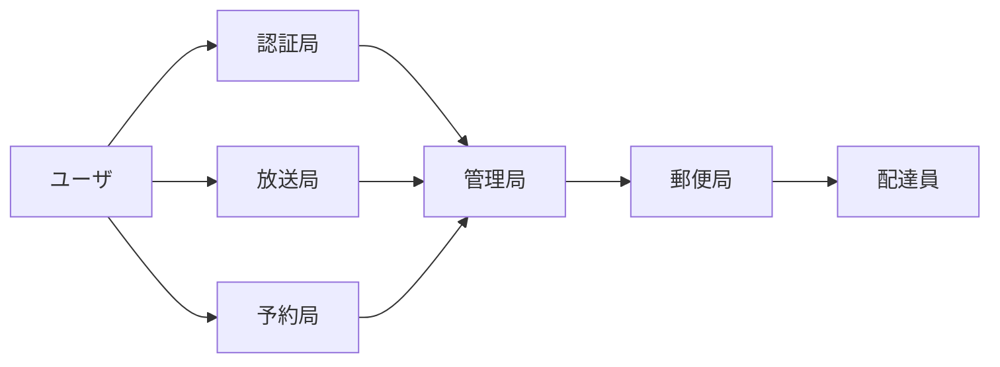
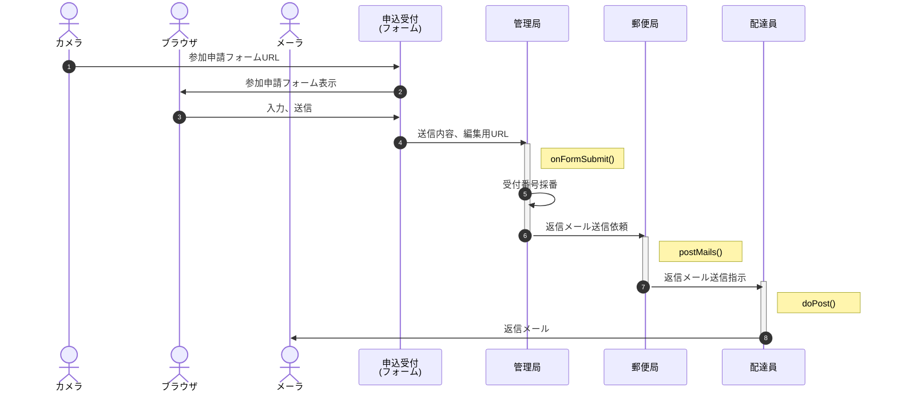
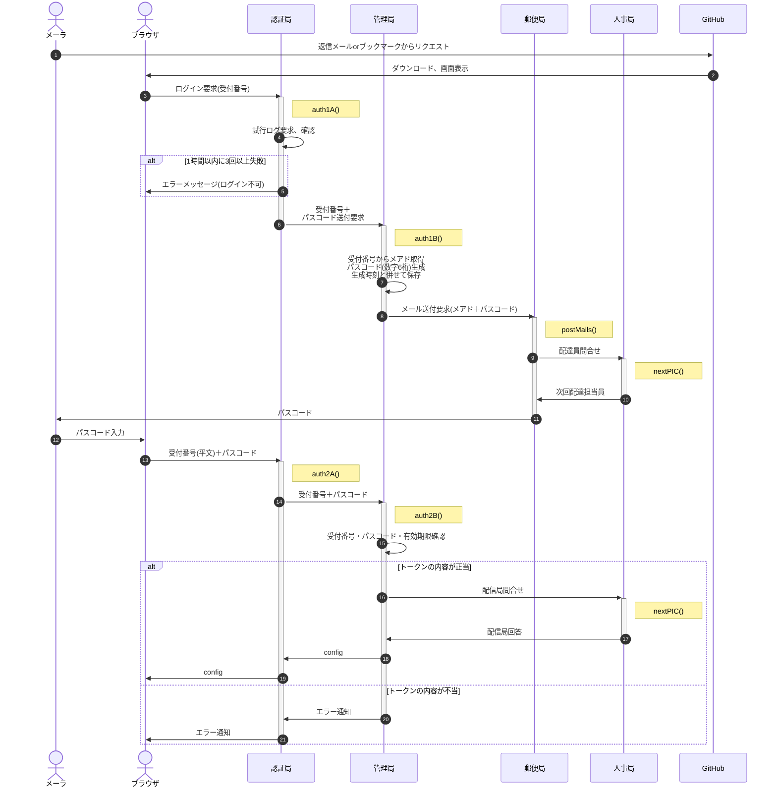
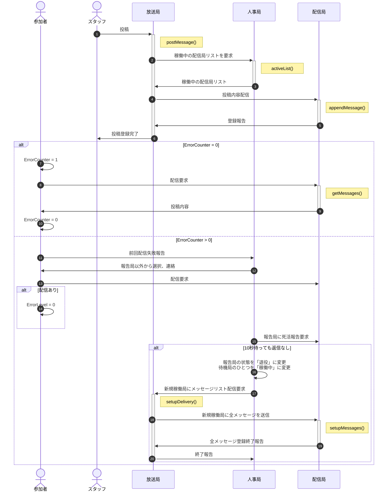
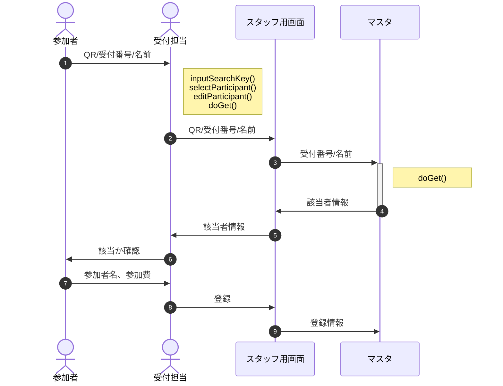

# JSDoc

[認証局](./doc/auth/global.html) |
[放送局](./doc/broad/global.html) |
[管理局](./doc/master/global.html) |
[郵便局](./doc/post/global.html) |
[配達員](./doc/delivery/global.html) |
[szLib](./doc/szLib/global.html) |
EventStaff.js |
[library.js](./doc/library/global.html)

# 開発の目的

## 現状

- 受付の効率化のため、参加申請を紙ベースからGoogle Formに変更
- 参加者へのイベント進行案内は、紙ベースの「予定表」として配布
- スタッフ間の連携は、基本的に対面ベース

## 課題

1. フォームになって申込期限ギリギリの申請が増加、当日参加が爆発的に発生
   - 需要予測が困難(ex.綿あめの担当者は足りる？　カレーは何食分用意する？) ※ 紙ベースならリアルタイムに把握できないのだから、そもそも気にしない？
   - 当日参加は受付担当のみ概数を把握(詳細は無理)、スタッフ全員に伝えるのも困難
   - 当日参加用申込用紙が途中でなくなり、フリーフォーマットで対応
     - 書き方の案内が必要、受付が忙しくなるにつれどんどん適当に(必要事項の記載漏れ)

2. 各コーナーの状況がスタッフ・参加者共わからない
   - 「カレーは何時から配膳？(今から参加して食べられる？)」「缶バッチはまだやってる？」「うちの子の肝試しは何時頃終わる？(何時にお迎えに来れば良い？)」
   - 参加者はもちろん、スタッフも担当外のコーナーの状況はわからない

3. 希望の多いコーナーは混雑・混乱、参加者の不満に
   - 長蛇の列に並んでいる時間が長く、他のコーナーを見に行けない
   - 同じ子が何度も参加、横入りされたり小さい子が諦める事例も

## 解決案

1. 当日参加も含め、参加申請はフォームでイベント終了まで受付
   - 受付でのチェックはクラウド上の名簿を参照 ※万一に備え紙ベースの名簿はバックアップとして用意
   - 紙での申請はスマホが無い当日参加希望者のみ、受付担当は【必要最低限の属性情報のみ】入力

2. スタッフ・参加者は自分のスマホで(ほぼ)リアルタイムに状況を把握可能に
   - スタッフ用に双方向の業務連絡を実現(簡易チャット。ex.「お手隙のスタッフは綿あめ周辺の誘導に来て」)
   - 自担当イベントの進行状況は随時発信。参加者も参照可能に。
   - マスタと連携して参加者をセグメント化、各種お知らせを配信(※スタッフ→参加者の一方向) 例：「受付番号100番までの1年生のご家族はカレーをお受け取りください」
   - 配信用端末(スマホ)が無い人のためには、本部前へのディスプレイ設置等で別途対応

3. コーナー毎に順番の予約を可能に
   - 参加者個々人にQRコード(参加者番号)が印刷されたカードを配布
   - コーナーの前に端末を用意、QRコードを読ませて予約(状態：予約中)、順番が来たらもう一度読ませる(状態：参加中) 
     ※できれば終了時点でもう一度読ませたい(状態：無予約)が、面倒そう...
   - 端末では「参加した回数」と「予約時刻」をキーに参加者番号を表示、コーナー担当は表示順にその場にいる子を呼ぶ ※その場にいない子はスキップするが、順番はトップが維持される

## 解決案実行のメリット、デメリットと対策

- メリット
  - カレー配膳や肝試し等、セグメント別の誘導が円滑になる
  - 「アンケートのお願い」等、従来メアドがわからなかった当日参加の方にも当日・事後に連絡がつけられるようになる

- デメリット
  - 期限ギリギリの申請・当日参加がより増える
    - 対策案：申請期限の設定は継続、期限前＞期限〜前日＞当日の順に優先(ex.テント設営場所、配膳の順番、ゲームコーナー)
  - 慣れない手順なのでスタッフ側が事前に習熟しておく必要がある(学習コストが発生)
    - 対策案：学習コストは極限まで切り詰め、1時間程度に収める(UIを工夫、「次に何をすれば良いか」を常に表示)
    - 対策案：常連のスタッフは事前に、スポット参加のスタッフは当日朝に時間をとる

# 処理の流れ

1. 参加登録(参加者・スタッフ共通)
2. ログイン、お知らせ表示(参加者・スタッフ共通)
3. 受付
   - 参加登録済の方、当日参加でもスマホで参加登録可能な方
   - 当日参加でスマホでの参加登録ができない方
4. お知らせへの投稿(スタッフのみ)
5. コーナー予約

## 1. 参加登録(参加者・スタッフ共通)

- 人のアイコンは参加者・スタッフのスマホ(or タブレット or PC)上のカメラ・ブラウザ・メーラ
- 最後の⑧はスタッフのみ、参加者は不要。

登録終了通知メール(サンプル)

※「::〜::」の部分は実データで置換されます。

::name:: 様

下北沢小学校おやじの会です。この度は参加登録、ありがとうございました。

  受付番号
  
::entryNo::

引き続き以下のボタンをクリックし、表示されたサイトをブックマークしておいていただけますようおねがい致します。

  <a href="https://nakaone.github.io/EventStaff/" target="_blank" class="btn btn--blue btn--border-double">専用サイト</a>

このページは参加者の皆様に以下の機能・情報を提供します。

<ol>
<li>参加メンバの追加・取消、申込のキャンセル</li>
<li>当日受付での受付番号(QRコード)の表示</li>
<li>運営からのリアルタイムお知らせ表示</li>
<li>イベント各コーナーの予約待ち状況表示</li>
<li>進行予定表、マップ表示</li>
</ol>

※ 個人情報保護のため、これらの情報を表示するためにはログインが必要です。ご利用の際は画面の指示に従って受付番号を入力してください。

!! ログインできない場合 !!

chrome,safari,firefox等のブラウザではなく、Gmail等のメーラーから専用サイトが開かれると、以下のようにうまくログインできない場合があります。

<ol>
<li>上のボタンで専用サイトに遷移し、受付番号を入力</li>
<li>「パスコードを記載したメールを送りました」のメッセージが出る</li>
<li>メールを確認するため「戻る」と、専用サイトが見えなくなってしまう</li>
</ol>

この場合は以下のいずれかの対応を行い、専用サイトはブラウザで開いていただけますようお願いします。

<ol>
<li>本メールの「専用サイト」ボタンを長押しして「ブラウザで開く」を選択</li>
<li>メーラーで専用サイトを開き、メニュー(「⁝」等)から改めてブラウザで開き直す</li>
<li>予め別途ブラウザを開いておき「https://nakaone.github.io/EventStaff/」と入力</li>
</ol>

ご不明な点がありましたら<a href="mailto:shimokitasho.oyaji@gmail.com">shimokitasho.oyaji@gmail.com</a>宛お問合せください。

当日のお越しをお待ちしております。

_

## 2. ログイン、お知らせ表示

## 3.(1) 参加登録済の方の受付

以下は参加者・スタッフともログイン済の前提。

## 3.(2) 当日参加(スマホなし)の受付

## 4. お知らせへの投稿(スタッフのみ)

GCPの無料枠に収めるため、送受信の情報量・頻度は極力絞る(Max.1GB/日)

配信対象のグルーピングは以下を想定
- 参加者の属性(ex.未就学児/1〜6年生/卒業生/保護者)
- 受付番号の範囲(ex. No.10以上20以下)
- スタッフの担当(ex. 受付、射的、お化け屋敷、スタッフ全員)

## 5. コーナー予約

※未実装

綿飴の予約や射的の回数制限、ヨーヨーの販売などを行うなら参加者の個々人の識別が必要になる。
また「綿あめがもうすぐできるよ」等のフィードバックを行う場合、通知先は親のスマホとなるため、受付番号との紐付けが必要になる。

以下は仮に行うとした場合の実現手段の想定。
- 中身は1からの連番であるQRコードを印刷した「参加者証」を用意
- 受付時、カードを参加者に配布、受付番号と一括してスキャンして紐付け
- 個別の通知はカード番号→受付番号を特定して一斉配信で

# システム間連携

以降は開発者向けの詳細。

## サブシステム一覧

No | 名称 | prefix | 個数 | 概要
--: | :-- | :-- | :--: | :--
1 | 申請窓口 | Form | 1 | 参加者・スタッフの参加申請をフォームで登録
2 | 管理局 | Master | 1 | 個別参加者・スタッフの申請内容及び権限を管理
3 | 認証局 | Auth | 1 | 閲覧・使用申請について、管理局と連携して権限の有無を確認
4 | 郵便局 | Post | 1 | 参加申請への返信、パスコード配信等、メール作成・配信手配
5 | 配達員 | deli | n | 郵便局からの指示に基づきメールを配信
6 | 放送局 | Broad | 1 | 投稿された内容を保存、「お知らせ」として配信
7 | 中継局 | Trans | n | 放送局の内容をミラーリング、配信負荷を分散(配達員と統合予定)
8 | 予約局 | Book | 1 | スタッフ端末からの予約・取消情報に基づき待機者一覧を作成、配信

ここでサブシステムとはGoogleドライブ上のフォームまたはシート等のコンテナを指す。

prefixとはURL,Key等の識別用。個数nは親局と1:n関係にあることを示す。

各サブシステムは別アカウントにあっても稼働可能。但し被参照局は当該コンテナの共有で参照局のアカウントを「閲覧可」として登録する。

### 局間の参照・被参照関係

局間では以下のような参照・被参照関係がある。

ソースにAPIのURLを埋め込むと被参照局で再デプロイの都度、参照局もデプロイが必要になるため、管理局の「config」シートに一覧を作成し、実行時にszLib.setConfig()で最新情報を参照する。

## 1. 参加登録

- メールはGASのメール100通/日の制限を回避するため、複数のアカウントに送信専用API(配達員)を用意し、順次使用する。

- 返信メールには以下の内容を記載する。
  - 受付番号
  - GitHub URL

## 2. ログイン(認証)

- 伝送路はPOSTに限定し、暗号化やトークンの使用は行わない
- 認証は参加者画面を開く都度行う(localStorageへの保存は行わない)

<!--
- 伝送説明文の末尾の括弧は、暗号化する際の鍵。「受付番号(共通鍵)」は「受付番号を共通鍵で暗号化した文字列」の意味
- トークンは受付番号・パスコードと時刻を基に生成されるワンタイムパスワード(TOTP)
  - パスコードは6桁の数字、時刻は10分単位で採番したものをハッシュ化して復元不能にする。 
    受付番号 1234 ＋ パスコード 567890 ＋ 2022/10/30 05:26:02 -> 123456789020221030052
  - 端末・サーバ間の時刻のずれやネットワークの遅延を考慮し、復号時は処理時点と前後1スパンを許容 -> 1030052, 1030051 , 1030053
- 参加者画面(html)は、クエリパラメータが存在しなければ受付番号入力(＋QRコードスキャン)画面を、存在すればそれを共通鍵で暗号化された受付番号と見做しパスコード入力画面を表示する
-->

## 3. お知らせ表示

## 4.(1) 受付(フォーム)

参加者の変更は極力受付前に終了してもらう。無理なら受付後でも可。

## 5. お知らせへの投稿
