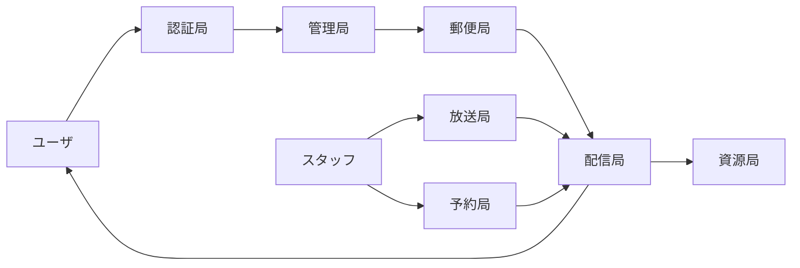
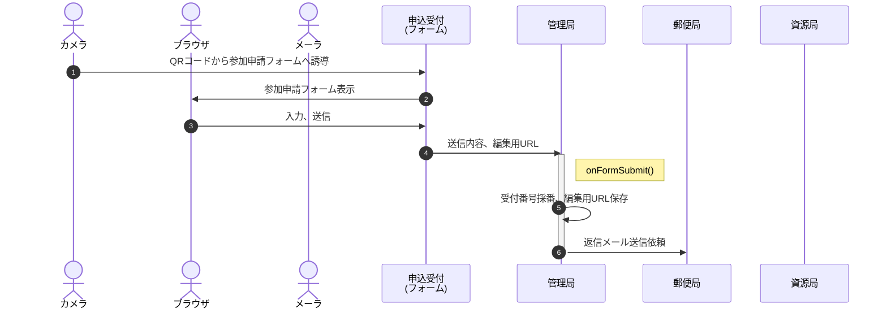
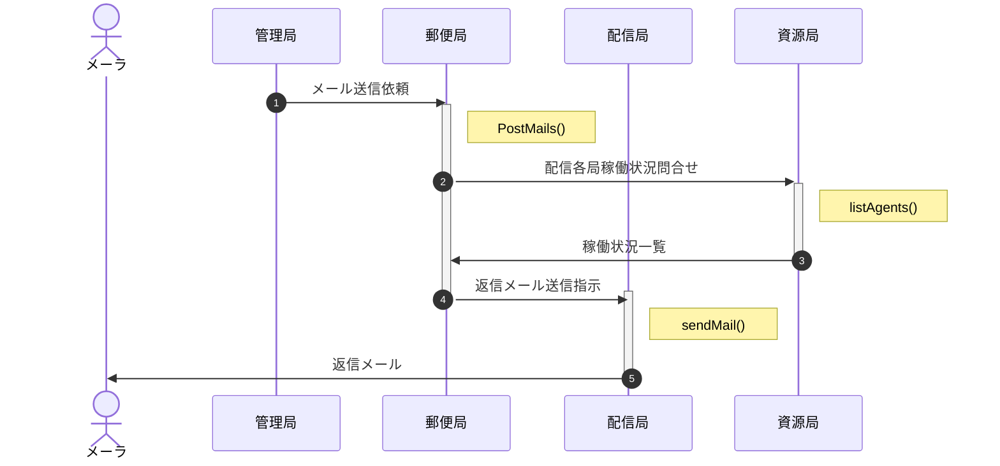
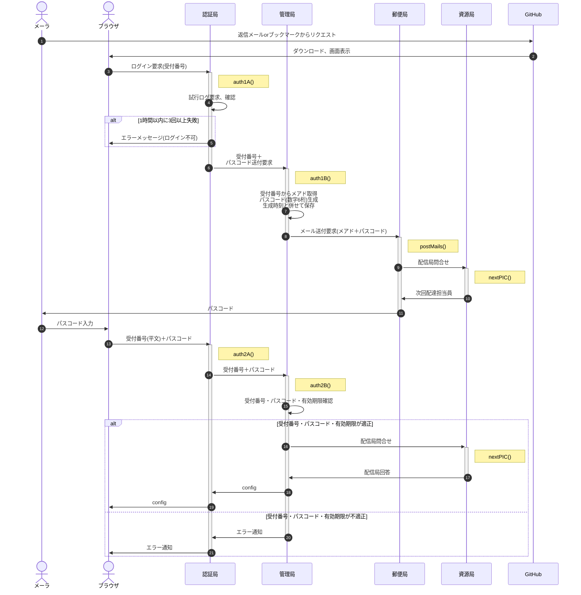
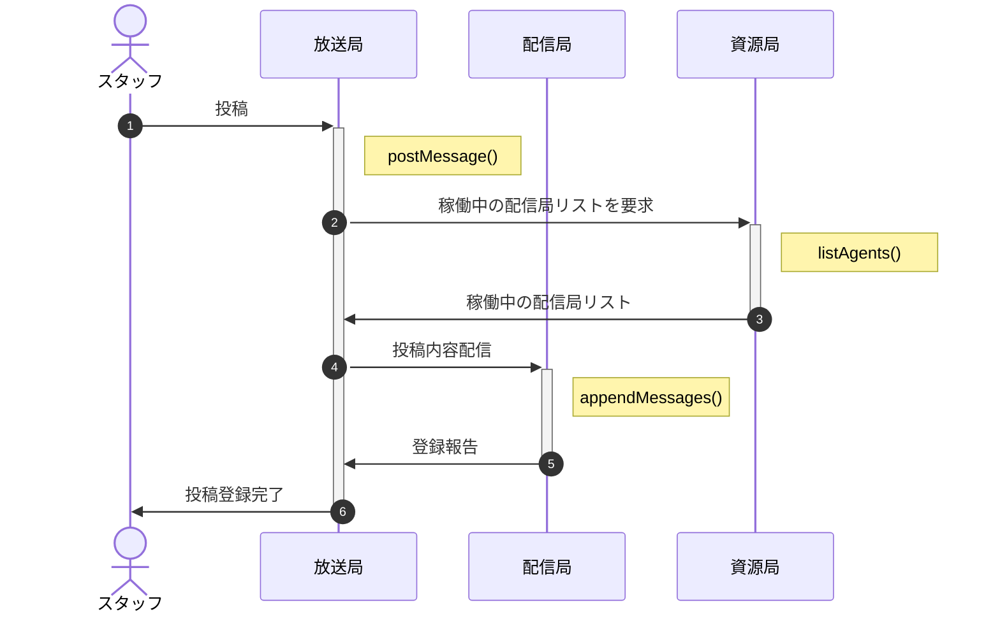
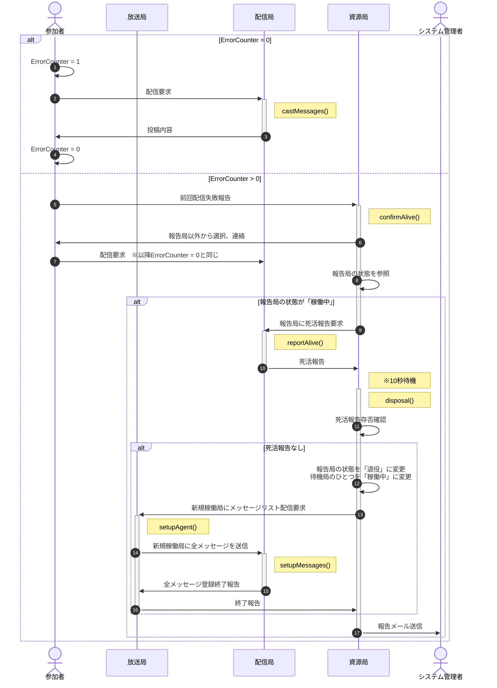
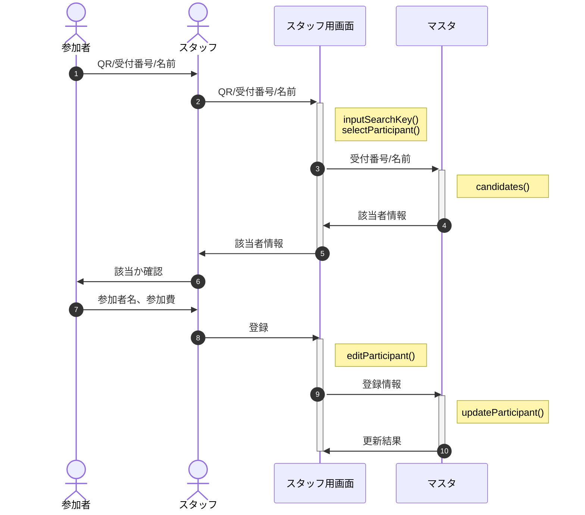
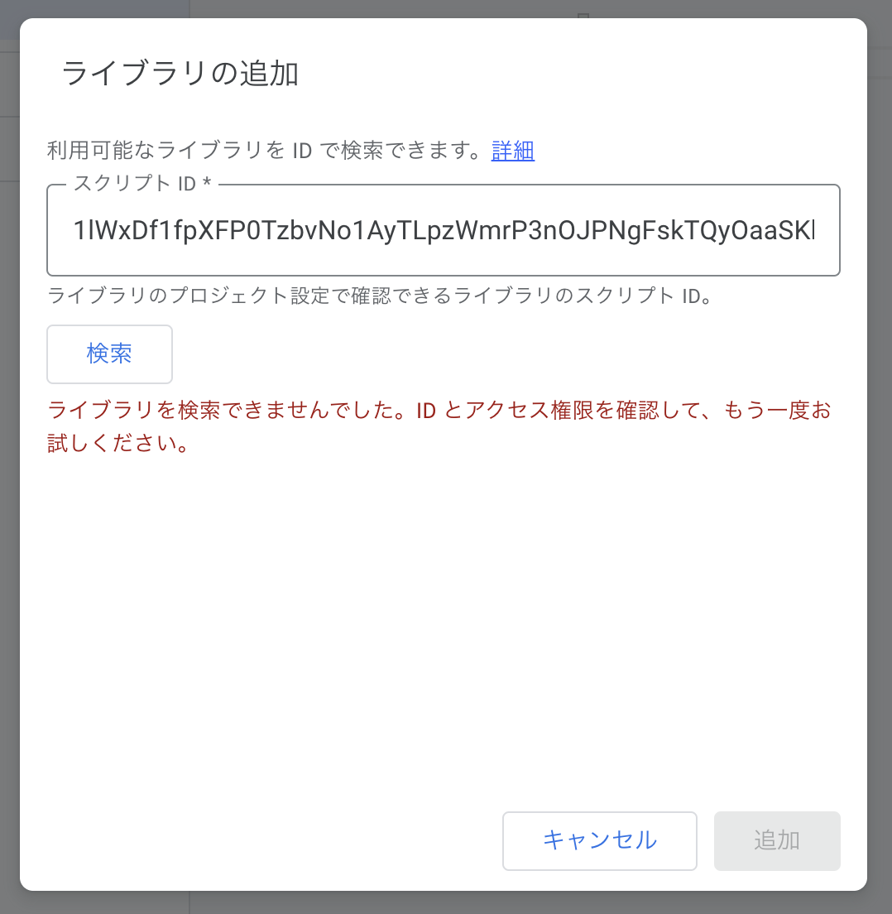

[概要](../README.md) | サーバ側仕様 | [クライアント側仕様](client.md)

# [01] システム間連携

## 性能要件とGASの制約

### 想定所要

- 参加申込みへの返信メール
  - 参加申込数500口、参加人数1,000人
  - 参加申込は10日以上に分散、但し開催前日および当日は各25%(125口)の申込みが発生
  - ピーク想定：開催当日125通のメール送信
- 二段階認証時のパスコード送信メール
  - パスコード配信は、当日に集中してスマホ利用者数×1.5倍発生(1倍超は操作ミス等による複数回ログイン者)
  - スマホ利用者数は、参加申込数(500口)と一致。スタッフは参加申込数に含まれるものとする
  - ピーク想定：開催当日750通のメール送信
- 掲示板へのアクセス
  - お知らせ配信のため、20秒/回間隔で処理時間700msの掲示板へのアクセスが発生
  - 期間は当日08:00〜20:00の12時間
    - 08:00〜13:00 スタッフのみなので5%
    - 13:00〜18:00 スタッフ5%＋参加者の30%(残りはセッション継続だがブラウザを開いていない想定)
    - 18:00〜20:00 スタッフ5%＋参加者の10%(順次帰宅)
  - ピーク想定：3回/分×60分×0.7秒×500口 = 63,000秒/時 ...(a)
    - 08:00〜13:00(5H) ×  5% × a =  15,750秒
    - 13:00〜18:00(5H) × 35% × a = 110,250秒
    - 18:00〜20:00(2H) × 15% × a =  18,900秒
    - 処理時間合計：144,900秒(2415分)

### GASの制約と対応

- [GASの制約](https://tetsuooo.net/gas/1101/#)
  - トリガーの総実行時間：90分/日
  - メール発信100通/日

■対応

1. クライアントへの配信に特化した「配信局」を別アカウントで複数作成、20〜30%を「稼働中」とし残りを「待機中」とする
1. クライアントへの配信とは、メール配信およびクライアント側の定期的情報更新が必要なお知らせ配信(＋将来的には予約状況)を指す。
1. 配信局の稼働状況を「資源局」で管理。制約により稼働不能になったアカウントを「退役」とし、待機中から一つ選んで「稼働中」とする
1. 「お知らせ」はスタッフが「放送局」に投稿後、放送局から各配信局に配信する。
1. 認証局、管理局等の全体コントロールも規模に合わせて別アカウントにする
1. 各局間は共通鍵で認証する。共通鍵はszLibに保存し、szLibは限定列挙されたアカウントのみ閲覧可とする

なお集中アクセスに対する負荷等、インフラの性能に起因する問題は考慮しない

## サブシステム一覧

No | 名称 | prefix | 個数 | 概要
--: | :-- | :-- | :--: | :--
1 | 申請窓口 | Form | 1 | 参加者・スタッフの参加申請をフォームで登録
2 | 管理局 | Master | 1 | 個別参加者・スタッフの申請内容及び権限を管理
3 | 認証局 | Auth | 1 | 閲覧・使用申請について、管理局と連携して権限の有無を確認
4 | 郵便局 | Post | 1 | 参加申請への返信、パスコード配信等、メール作成・配信手配
5 | 配信局 | Agent | n | 郵便局からの指示に基づきメールを配信 放送局の内容をミラーリング、配信負荷を分散
6 | 放送局 | Broad | 1 | 投稿された内容を保存、「お知らせ」として配信
7 | 資源局 | Agency | 1 | 配信局のリソース使用状況を監視、適宜待機中→稼働中→退役に変更
8 | 予約局 | Book | 1 | スタッフ端末からの予約・取消情報に基づき待機者一覧を作成、配信

ここでサブシステムとはGoogleドライブ上のフォームまたはシート等のコンテナを指す。

prefixとはURL,Key等の識別用。個数nは親局と1:n関係にあることを示す。

各サブシステムは別アカウントにあっても稼働可能。但し被参照局は当該コンテナの共有で参照局のアカウントを「閲覧可」として登録する。

## 局間の参照・被参照関係

局間では以下のような参照・被参照関係がある。

- 資源局は配信局以外の局も監視するが、上の図からは割愛
- ソースにAPIのURLを埋め込むと被参照局で再デプロイの都度、参照局もデプロイが必要になるため、管理局の「config」シートに一覧を作成し、実行時にszLib.setConfig()で最新情報を参照する。

# [02] シーケンス

## 1. 参加登録

- 返信メールには以下の内容を記載する。
  - 受付番号
  - GitHub URL
- 返信メール送信依頼以降、引き続き「2.メール配信」に続く

## 2. メール配信

- 配信局は「配信可能な配信局の内、一番早く死にそうな局」を選択する。具体的には以下の論理積 
  - 稼働中又は待機中(退役は除く)
  - 24時間以内の配信通数が100通未満
  - 処理時間の合計が最大

## 3. ログイン(認証)

- 伝送路はPOSTに限定し、暗号化やトークンの使用は行わない
- 認証は参加者画面を開く都度行う(localStorageへの保存は行わない)
- auth2B返信時は申込情報も添付(将来的なセグメント配信用)

<!--
- 伝送説明文の末尾の括弧は、暗号化する際の鍵。「受付番号(共通鍵)」は「受付番号を共通鍵で暗号化した文字列」の意味
- トークンは受付番号・パスコードと時刻を基に生成されるワンタイムパスワード(TOTP)
  - パスコードは6桁の数字、時刻は10分単位で採番したものをハッシュ化して復元不能にする。 
    受付番号 1234 ＋ パスコード 567890 ＋ 2022/10/30 05:26:02 -> 123456789020221030052
  - 端末・サーバ間の時刻のずれやネットワークの遅延を考慮し、復号時は処理時点と前後1スパンを許容 -> 1030052, 1030051 , 1030053
- 参加者画面(html)は、クエリパラメータが存在しなければ受付番号入力(＋QRコードスキャン)画面を、存在すればそれを共通鍵で暗号化された受付番号と見做しパスコード入力画面を表示する
-->

## 4. お知らせへの投稿

## 5. クライアントへの定期配信

- fetchGASのFromは受付番号を使用、passPhraseは共通鍵を使用する
- 配信局の状態は「待機中」「稼働中」「退役後」のいずれか
- 退役があった場合、システム管理者にメールで報告
- 資源局は待機中・稼働中のアカウントについてリストを作成(除、退役後)、負荷状況を郵便局と共有する
- 資源局が配信局リストを持ち郵便局はそれを共有、稼働中のアカウントから24時間以内で配達数最小の配信局を選ぶ。稼働中のアカウントがすべて100通/日以上なら待機中のアカウントを使用する。

## 4.(1) 受付(フォーム)

参加者の変更は極力受付前に終了してもらう。無理なら受付後でも可。

## 5. お知らせへの投稿

# [03] GASライブラリ(szLib)

参考：[自作のライブラリを公開する方法【Google Apps Script / GAS】](https://belltree.life/google-apps-script-library-publish/)

※「403: access_denied」が出たら以下の手順で利用するプロジェクトを登録。

1. https://console.developers.google.com/
1. OAuth同意画面
1. すでにIDとシークレットを取得できているので、「テスト」のしたにアプリを公開
1. 本番環境にPUSHしますか？で「確認」

参考：[Google認証エラー 403: access_deniedを解決したい](https://teratail.com/questions/308789)

注意
- ライブラリ更新の都度デプロイは不要。開発版を選択していれば最新のソースが適用される。
- アロー関数は`TypeError: xxx is not a function.`となる(原因不明)ので、関数は`function xxx(){〜}`で定義する。
- JSDocの書き方：[param](https://jsdoc.app/tags-param.html), [return](https://jsdoc.app/tags-returns.html)
- アクセス権は利用するアカウントに限定する(下は対象外アカウントで追加しようとした場合の検証結果)
  

<dl>
<dt><a href="#getConf">getConf()</a> ⇒ <code>object</code></dt>
<dd>
getConf: おまつり奉行用の各種パラメータを取得

</dd>
<dt><a href="#elaps">elaps(arg, result)</a> ⇒ <code>void</code></dt>
<dd>
elaps: 資源局ログシートへの書き込み

</dd>
<dt><a href="#fetchGAS">fetchGAS(arg)</a> ⇒ <code>void</code></dt>
<dd>
fetchGAS: GASのdoPostを呼び出し、後続処理を行う
 
処理内部で使用する公開鍵・秘密鍵はszLib.getUrlKey()で取得。 
なおhtml版のarg.callbackはGAS版では存在しない。

</dd>
<dt><a href="#getJPDateTime">getJPDateTime(dt, locale)</a> ⇒ <code>string</code></dt>
<dd>
getJPDateTime: 指定日時文字列を作成

</dd>
<dt><a href="#szSheet">szSheet(arg)</a> ⇒ <code>object</code></dt>
<dd>
szSheet: シートのデータ取得等、CRUDするメソッドを持つオブジェクトを返す

</dd>
<dt><a href="#convertCharacters">convertCharacters(str, kana)</a> ⇒ <code>string</code></dt>
<dd>
convertCharacters: 文字種を変換
  
全角英数字は半角に、半角片仮名は全角に強制的に変換。 
全角ひらがな&lt;-&gt;全角カタカナは引数(kana)で指定。既定値はひらがなに変換。 
 参考：

<ul>
<li>[全角ひらがな⇔全角カタカナの文字列変換](https://neko-note.org/javascript-hiragana-katakana/1024)
<li>[全角⇔半角の変換を行う(英数字、カタカナ)](https://www.yoheim.net/blog.php?q=20191101)
</ul></dd>
<dt><a href="#whichType">whichType(arg)</a> ⇒ <code>string</code></dt>
<dd>
whichType: 変数の型を判定

</dd>
</dl>

## getConf() ⇒ <code>object</code>
getConf: おまつり奉行用の各種パラメータを取得

**Kind**: global function  
**Returns**: <code>object</code> - おまつり奉行用の各種パラメータ  

| Param | Type | Description |
| --- | --- | --- |
|  | <code>void</code> | なし |

## elaps(arg, result) ⇒ <code>void</code>
elaps: 資源局ログシートへの書き込み

**Kind**: global function  
**Returns**: <code>void</code> - - なし  

| Param | Type | Description |
| --- | --- | --- |
| arg | <code>object</code> |  |
| arg.startTime | <code>number</code> | 開始時刻 |
| arg.account | <code>string</code> | 実行アカウント名 |
| arg.department | <code>string</code> | 局名 |
| arg.func | <code>string</code> | function/method名 |
| result | <code>string</code> | 結果 |

## fetchGAS(arg) ⇒ <code>void</code>
fetchGAS: GASのdoPostを呼び出し、後続処理を行う
 
処理内部で使用する公開鍵・秘密鍵はszLib.getUrlKey()で取得。 
なおhtml版のarg.callbackはGAS版では存在しない。

**Kind**: global function  
**Returns**: <code>void</code> - なし  

| Param | Type | Description |
| --- | --- | --- |
| arg | <code>object</code> | 引数 |
| arg.from | <code>string</code> | 送信側のコード名(Auth, Master等) |
| arg.to | <code>string</code> | 受信側のコード名 |
| arg.func | <code>string</code> | GAS側で処理分岐の際のキー文字列 |
| arg.endpoint | <code>string</code> | 受信側のコード名からURLが判断できない(配達員の)場合に指定 |
| arg.key | <code>string</code> | endpoint指定の場合はその鍵も併せて指定 |
| arg.data | <code>any</code> | 処理対象データ |

## getJPDateTime(dt, locale) ⇒ <code>string</code>
getJPDateTime: 指定日時文字列を作成

**Kind**: global function  
**Returns**: <code>string</code> - 指定形式＋ミリ秒の日時文字列  

| Param | Type | Default | Description |
| --- | --- | --- | --- |
| dt | <code>any</code> | <code></code> | 作成する日時の指定。省略時は現在時刻 |
| locale | <code>string</code> | <code>&quot;ja-JP&quot;</code> | 作成する形式 |

## szSheet(arg) ⇒ <code>object</code>
szSheet: シートのデータ取得等、CRUDするメソッドを持つオブジェクトを返す

**Kind**: global function  
**Returns**: <code>object</code> - 取得したシートのデータ
<ul>
<li>sheet  {object}   - getSheetで取得したシートのオブジェクト
<li>raw    {any[][]}  - 取得した生データ(二次元配列)
<li>headerRow {number} - ヘッダ行番号
<li>keys   {string[]} - ヘッダ行の一次元配列
<li>data   {object[]} - データ行を[{ラベル1:値, ラベル2:値, ..},{..},..]形式にした配列
<li>lastRow {number} - データが存在する最下行の行番号(>0)
<li>lookup {function} - メソッド。(key,value)を引数に、項目名'key'の値がvalueである行Objを返す
<ul>  

| Param | Type | Description |
| --- | --- | --- |
| arg | <code>object</code> \| <code>string</code> | 文字列の場合、コンテナのシートでヘッダ行は1行目と看做す |
| arg.spreadId | <code>string</code> | 外部スプレッドシートのID |
| arg.sheetName | <code>string</code> | シート名 |
| arg.headerRow | <code>number</code> | ヘッダ行の行番号(>0)。既定値1。項目名は重複不可 |

## convertCharacters(str, kana) ⇒ <code>string</code>
convertCharacters: 文字種を変換
  
全角英数字は半角に、半角片仮名は全角に強制的に変換。 
全角ひらがな<->全角カタカナは引数(kana)で指定。既定値はひらがなに変換。 
 参考：
<ul>
<li>[全角ひらがな⇔全角カタカナの文字列変換](https://neko-note.org/javascript-hiragana-katakana/1024)
<li>[全角⇔半角の変換を行う(英数字、カタカナ)](https://www.yoheim.net/blog.php?q=20191101)
</ul>

**Kind**: global function  
**Returns**: <code>string</code> - 変換結果  

| Param | Type | Default | Description |
| --- | --- | --- | --- |
| str | <code>string</code> |  | 変換対象文字列 |
| kana | <code>boolean</code> | <code>true</code> | true:ひらがな、false:カタカナ |

## whichType(arg) ⇒ <code>string</code>
whichType: 変数の型を判定

**Kind**: global function  
**Returns**: <code>string</code> - - 型の名前  

| Param | Type | Description |
| --- | --- | --- |
| arg | <code>any</code> | 判定対象の変数 |

## バックアップライブラリ(nklib)

開発途中で使用中止となった機能のバックアップ。

# [04] 申請窓口(Form)

## 01.「質問」タグ

適切な内容が入力されるよう「回答の検証」に以下の正規表現を設定

- 氏名：".+　.+" / ".+"
- 氏名読み："[ァ-ヾ]+　+[ァ-ヾ　]+" / "[ァ-ヾ　]+"

「ヷ」「ヸ」「ヹ」「ヺ」等、ひらがなでは対応する文字がないものがあるので、カタカナで入力
(参考：Unicode
[片仮名](https://ja.wikipedia.org/wiki/%E7%89%87%E4%BB%AE%E5%90%8D_(Unicode%E3%81%AE%E3%83%96%E3%83%AD%E3%83%83%E3%82%AF)),
[平仮名](https://ja.wikipedia.org/wiki/%E5%B9%B3%E4%BB%AE%E5%90%8D_(Unicode%E3%81%AE%E3%83%96%E3%83%AD%E3%83%83%E3%82%AF)))

## 02.「設定」タグ

- メールアドレスを収集する：ON
- 回答のコピーを回答者に送信：リクエストされた場合
- 回答の編集を許可する：ON

# [05] 管理局(Master)

## 01.「マスタ」シート

## 02.「AuthLevel」シート

各機能の活性化/不活性化を司る。

メニュー名 | フラグ(2進数) | 値 | 参加者 | スタッフ (当日) | スタッフ (コア) | スタッフ (コーナー)
:-- | :--: | --: | --: | --: | --: | --:
未設定 | 0000 0000 : 0000 0000 | 0 |  |  |  | 
お知らせ | 0000 0000 : 0000 0001 | 1 | 1 | 1 | 1 | 1
受付番号表示 | 0000 0000 : 0000 0010 | 2 | 2 |  |  | 
予約状況参照 | 0000 0000 : 0000 0100 | 4 | 4 | 4 | 4 | 4
アンケート | 0000 0000 : 0000 1000 | 8 | 8 |  |  | 
進行予定 | 0000 0000 : 0001 0000 | 16 | 16 | 16 | 16 | 16
校内案内図 | 0000 0000 : 0010 0000 | 32 | 32 | 32 | 32 | 32
募集要項 | 0000 0000 : 0100 0000 | 64 | 64 | 64 | 64 | 64
システム | 0000 0000 : 1000 0000 | 128 | 128 | 128 | 128 | 128
該当者検索 | 0000 0001 : 0000 0000 | 256 |  |  | 256 | 256
参加状況 | 0000 0010 : 0000 0000 | 512 |  | 512 | 512 | 512
コーナー予約 | 0000 0100 : 0000 0000 | 1024 |  |  |  | 1024
— | — | — | 255 | 757 | 1013 | 2037

※お知らせは全員に配信し、内容はサーバ側で属性に応じて編集するので AuthLevel による制御は行わない。

# [06] 認証局(Auth)

## 01.「log」シート：認証成否のログ

列 | 項目名 | 内容
:--: | :-- | :--
A | timestamp | 認証日時
B | entryNo | 受付番号
C | result | 結果。OK or NG
D | message | エラーの場合、メッセージ

# [07] 放送局(Broad)

## 01.「掲示板」シート：投稿内容のログ

列 | 項目名 | 内容
:--: | :-- | :--
A | timestamp | 投稿日時
B | from | 投稿者
C | to | 宛先
D | message | メッセージ
E | axis01 | 予約(セグメント別配信時のフラグ)
F | axis02 | 同上
G | axis03 | 同上

# [08] 郵便局(Post)

## 01.「配達記録」シート：過去の配達担当(配信局)と配達結果

列 | 項目名 | 内容
:--: | :-- | :--
A | timestamp | 送信日時
B | arg | 送信内容(sendMailの引数)
C | account | 配信局アカウント
D | result | 配信結果

## 02.メールテンプレートシート

1. 申込への返信
1. パスコード通知
1. 郵便局初期化

# [09] 配信局(Agent)

## 配信局作成手順

※ アカウントが異なる場合、バージョンに"HEAD"が指定できないので注意

### szLibの作業

1. 閲覧者として賦課アカウントのアクセス権を付与
1. スクリプトIDをコピー

### 賦課アカウント側の作業

1. Google Driveを開き、スプレッドシート「配信局」を新規作成
1. 「掲示板」シート作成
1. szLibをライブラリに追加(スクリプトIDをペースト)
1. Apps ScriptにGASソースをコピー
1. authorize()を実行して権限付与

## 01.「掲示板」シート

放送局「掲示板」シートと同じ(現状の放送局「ログ」シート名を「掲示板」に変更予定)。

# [10] 予約局(Reserve)

予約状況はそれだけで専用のシートを用意。スプレッドシート列毎に参加者専用スペースを確保、htmlから見にいく列を制御する。

掲示板も参加者専用スペースを用意、絞り込みを可能にする。

予約状況は予約が入った時点で更新する(定期的に見にいくと回数が徒に増える。参加者500名×コーナー平均参加回数15回×予約・参加時点の2回×実行時間0.3秒なら実行時間は4,500秒に抑えられる。一定時間経たないと送信しないという運用もありか)。

予約状況は総予約数の他に、利用回数別の予約人数を表示する。

# [11] 資源局(Agency)

## 01.「ログ」シート：アカウント・JOB別実行時間ログ(elaps)

列 | 項目名 | 内容
:--: | :-- | :--
A | timestamp | ジョブ開始時刻。Date.now()で得られたUNIX時刻
B | account | 処理したアカウント
C | requester | 局名。「管理局」「郵便局」等。
D | function/method | 処理関数名。doPostの分岐先
E | elaps | 処理時間。ミリ秒
F | result | 処理結果。OKまたはエラーメッセージ

## 02.「配信局」シート

列 | 項目名 | 内容
:--: | :-- | :--
A | type | 局種別。配信局、資源局、等
B | status | 待機中/稼働中/退役
C | account | 賦課アカウント
D | elaps | 過去24時間の総実行時間。ミリ秒
E | passPhrase | パスフレーズ
F | endpoint | APIのURL

## 11.authorize()
authorize: 初期化処理

**Kind**: global function  

## 12.doPost(e) ⇒ <code>object</code>
doPost: パラメータに応じて処理を分岐
 
Class UrlFetchApp <a href="https://developers.google.com/apps-script/reference/url-fetch/url-fetch-app#fetchurl,-params">fetch(url, params)</a> "Make a POST request with a JSON payload" 

**Kind**: global function  
**Returns**: <code>object</code> - 正常終了の場合は分岐先処理の戻り値、エラーの場合は以下。
<ul>
<li>isErr {boolean}  - true(固定)
<li>message {string} - エラーメッセージ
</ul>  

| Param | Type | Description |
| --- | --- | --- |
| e | <code>object</code> |  |
| e.postData | <code>object</code> |  |
| e.postData.contents | <code>object</code> |  |
| e.postData.contents.arg | <code>object</code> | データ部分。JSON.parse(e.postData.getDataAsString())の結果 |
| e.postData.contents.arg.passPhrase | <code>string</code> | 共通鍵。szLib.getUrl()で取得 |
| e.postData.contents.arg.from | <code>string</code> | 送信先(自分) |
| e.postData.contents.arg.to | <code>string</code> | 送信元 |
| e.postData.contents.arg.func | <code>string</code> | 分岐する処理名 |
| e.postData.contents.arg.data | <code>string</code> | 処理対象データ |

## 13.listAgents(arg) ⇒ <code>object</code>
listAgents: 配信局のリストを返す

**Kind**: global function  
**Returns**: <code>object</code> - rv 処理結果
<ul>
<li>isErr {boolean} : エラーならtrue
<li>message {string} : エラーの場合はメッセージ。正常終了ならundefined
<li>result {object} : szLib.szSheet().data
</ul>  

| Param | Type | Description |
| --- | --- | --- |
| arg | <code>void</code> | なし |