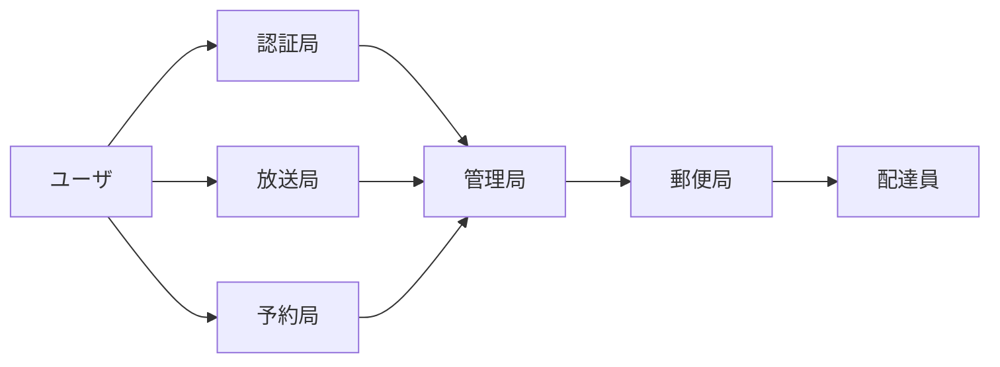
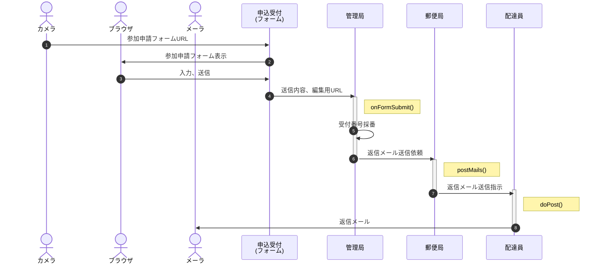
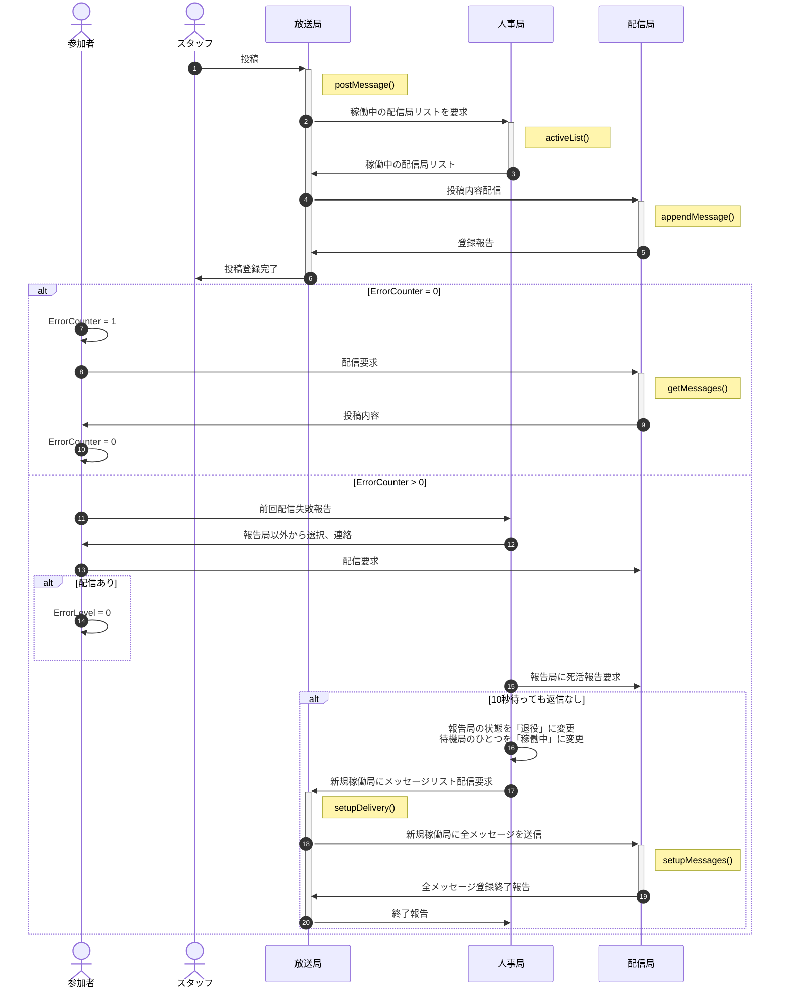
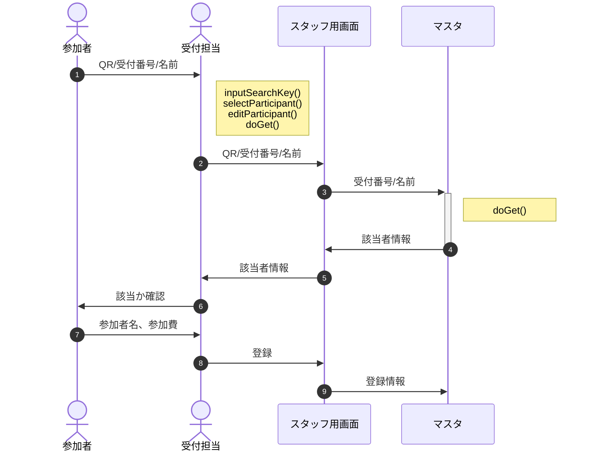

[概要](../README.md) | サーバ側仕様 | [クライアント側仕様](client.md)

# システム間連携

以降は開発者向けの詳細。

## GASの制約と対応

本来状況把握はプッシュ型で行いたかったが、GASの「トリガーの総実行時間：90分/日」という[制約](https://tetsuooo.net/gas/1101/#)から、プル型とする。

総実行時間90分 = 5,400秒 ＜ 平均滞在時間4時間 × 3600秒 ÷ インターバル20秒/回 × 想定利用者300名 × 実行時間0.3秒/回 = 64,800秒 

具体的には「情報が書き込まれたGoogleスプレッドを見にいく」という形で、htmlに`<iframe src="https://docs.google.com/〜?gid=〜&range=A1:B">〜</iframe>`のように設定する。

予約状況はそれだけで専用のシートを用意。スプレッドシート列毎に参加者専用スペースを確保、htmlから見にいく列を制御する。

掲示板も参加者専用スペースを用意、絞り込みを可能にする。

予約状況は予約が入った時点で更新する(定期的に見にいくと回数が徒に増える。参加者500名×コーナー平均参加回数15回×予約・参加時点の2回×実行時間0.3秒なら実行時間は4,500秒に抑えられる。一定時間経たないと送信しないという運用もありか)。

予約状況は総予約数の他に、利用回数別の予約人数を表示する。

## サブシステム一覧

No | 名称 | prefix | 個数 | 概要
--: | :-- | :-- | :--: | :--
1 | 申請窓口 | Form | 1 | 参加者・スタッフの参加申請をフォームで登録
2 | 管理局 | Master | 1 | 個別参加者・スタッフの申請内容及び権限を管理
3 | 認証局 | Auth | 1 | 閲覧・使用申請について、管理局と連携して権限の有無を確認
4 | 郵便局 | Post | 1 | 参加申請への返信、パスコード配信等、メール作成・配信手配
5 | 配達員 | deli | n | 郵便局からの指示に基づきメールを配信
6 | 放送局 | Broad | 1 | 投稿された内容を保存、「お知らせ」として配信
7 | 中継局 | Trans | n | 放送局の内容をミラーリング、配信負荷を分散(配達員と統合予定)
8 | 予約局 | Book | 1 | スタッフ端末からの予約・取消情報に基づき待機者一覧を作成、配信

ここでサブシステムとはGoogleドライブ上のフォームまたはシート等のコンテナを指す。

prefixとはURL,Key等の識別用。個数nは親局と1:n関係にあることを示す。

各サブシステムは別アカウントにあっても稼働可能。但し被参照局は当該コンテナの共有で参照局のアカウントを「閲覧可」として登録する。

## 局間の参照・被参照関係

局間では以下のような参照・被参照関係がある。

ソースにAPIのURLを埋め込むと被参照局で再デプロイの都度、参照局もデプロイが必要になるため、管理局の「config」シートに一覧を作成し、実行時にszLib.setConfig()で最新情報を参照する。

# シーケンス

## 1. 参加登録

- メールはGASのメール100通/日の制限を回避するため、複数のアカウントに送信専用API(配達員)を用意し、順次使用する。

- 返信メールには以下の内容を記載する。
  - 受付番号
  - GitHub URL

## 2. ログイン(認証)

- 伝送路はPOSTに限定し、暗号化やトークンの使用は行わない
- 認証は参加者画面を開く都度行う(localStorageへの保存は行わない)
- auth2B返信時は申込情報も添付(将来的なセグメント配信用)

<!--
- 伝送説明文の末尾の括弧は、暗号化する際の鍵。「受付番号(共通鍵)」は「受付番号を共通鍵で暗号化した文字列」の意味
- トークンは受付番号・パスコードと時刻を基に生成されるワンタイムパスワード(TOTP)
  - パスコードは6桁の数字、時刻は10分単位で採番したものをハッシュ化して復元不能にする。 
    受付番号 1234 ＋ パスコード 567890 ＋ 2022/10/30 05:26:02 -> 123456789020221030052
  - 端末・サーバ間の時刻のずれやネットワークの遅延を考慮し、復号時は処理時点と前後1スパンを許容 -> 1030052, 1030051 , 1030053
- 参加者画面(html)は、クエリパラメータが存在しなければ受付番号入力(＋QRコードスキャン)画面を、存在すればそれを共通鍵で暗号化された受付番号と見做しパスコード入力画面を表示する
-->

## 3. お知らせ表示

- fetchGASのFromは受付番号を使用、passPhraseは共通鍵を使用する
- 配信局の状態は「待機中」「稼働中」「退役後」のいずれか
- 退役があった場合、システム管理者にメールで報告
- 人事局は待機中・稼働中のアカウントについてリストを作成(除、退役後)、負荷状況を郵便局と共有する
- 人事局が配達員リストを持ち郵便局はそれを共有、稼働中のアカウントから24時間以内で配達数最小の配信局を選ぶ。稼働中のアカウントがすべて100通/日以上なら待機中のアカウントを使用する。

## 4.(1) 受付(フォーム)

参加者の変更は極力受付前に終了してもらう。無理なら受付後でも可。

## 5. お知らせへの投稿

# GASライブラリ(szLib)

参考：[自作のライブラリを公開する方法【Google Apps Script / GAS】](https://belltree.life/google-apps-script-library-publish/)

※「403: access_denied」が出たら以下の手順で利用するプロジェクトを登録。

1. https://console.developers.google.com/
1. OAuth同意画面
1. すでにIDとシークレットを取得できているので、「テスト」のしたにアプリを公開
1. 本番環境にPUSHしますか？で「確認」

参考：[Google認証エラー 403: access_deniedを解決したい](https://teratail.com/questions/308789)

注意
- ライブラリ更新の都度デプロイは不要。開発版を選択していれば最新のソースが適用される。
- アロー関数は`TypeError: xxx is not a function.`となる(原因不明)ので、関数は`function xxx(){〜}`で定義する。
- JSDocの書き方：[param](https://jsdoc.app/tags-param.html), [return](https://jsdoc.app/tags-returns.html)
- アクセス権は利用するアカウントに限定する
  

## バックアップライブラリ(nklib)

開発途中で使用中止となった機能のバックアップ。

# 局別設計(GAS)

## 申請窓口

### 「質問」タグ

適切な内容が入力されるよう「回答の検証」に以下の正規表現を設定

- 氏名：".+　.+" / ".+"
- 氏名読み："[ァ-ヾ]+　+[ァ-ヾ　]+" / "[ァ-ヾ　]+"

「ヷ」「ヸ」「ヹ」「ヺ」等、ひらがなでは対応する文字がないものがあるので、カタカナで入力
(参考：Unicode
[片仮名](https://ja.wikipedia.org/wiki/%E7%89%87%E4%BB%AE%E5%90%8D_(Unicode%E3%81%AE%E3%83%96%E3%83%AD%E3%83%83%E3%82%AF)),
[平仮名](https://ja.wikipedia.org/wiki/%E5%B9%B3%E4%BB%AE%E5%90%8D_(Unicode%E3%81%AE%E3%83%96%E3%83%AD%E3%83%83%E3%82%AF)))

### 「設定」タグ

- メールアドレスを収集する：ON
- 回答のコピーを回答者に送信：リクエストされた場合
- 回答の編集を許可する：ON

## 管理局

### 「回答」シート

### 「当日」シート

### 「マスタ」シート

### 「config」シート

- 「変更」は、プログラム実行中に値が変化するかどうか。
- 「設定元」は、その値がどこで設定されるか。
  - ソース：プログラムソース(config.js)
  - シート：GoogleスプレッドからQRで読み込み
  - 手動：ユーザが手動設定
  - 自動：プログラムで自動的に設定
- 「保存」はlocalStorageへの保存要否

- 2022/11/01追記：participant.htmlに"entryNo"追加
- 2022/11/02追記：分類AにAuthURL追加

### 「AuthLevel」シート

各機能の活性化/不活性化を司る。

メニュー名 | フラグ(2進数) | 値 | 参加者 | スタッフ (当日) | スタッフ (コア) | スタッフ (コーナー)
:-- | :--: | --: | --: | --: | --: | --:
未設定 | 0000 0000 : 0000 0000 | 0 |  |  |  | 
お知らせ | 0000 0000 : 0000 0001 | 1 | 1 | 1 | 1 | 1
受付番号表示 | 0000 0000 : 0000 0010 | 2 | 2 |  |  | 
予約状況参照 | 0000 0000 : 0000 0100 | 4 | 4 | 4 | 4 | 4
アンケート | 0000 0000 : 0000 1000 | 8 | 8 |  |  | 
進行予定 | 0000 0000 : 0001 0000 | 16 | 16 | 16 | 16 | 16
校内案内図 | 0000 0000 : 0010 0000 | 32 | 32 | 32 | 32 | 32
募集要項 | 0000 0000 : 0100 0000 | 64 | 64 | 64 | 64 | 64
システム | 0000 0000 : 1000 0000 | 128 | 128 | 128 | 128 | 128
該当者検索 | 0000 0001 : 0000 0000 | 256 |  |  | 256 | 256
参加状況 | 0000 0010 : 0000 0000 | 512 |  | 512 | 512 | 512
コーナー予約 | 0000 0100 : 0000 0000 | 1024 |  |  |  | 1024
— | — | — | 255 | 757 | 1013 | 2037

※お知らせは全員に配信し、内容はサーバ側で属性に応じて編集するので AuthLevel による制御は行わない。

## 認証局

## 放送局

## 郵便局

## 配達員

## 予約局

## 監督局
